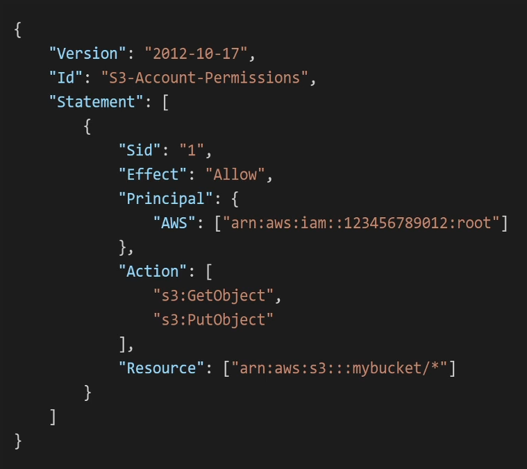

# Architect Associate

- [Architect Associate](#architect-associate)
  - [Aws Infrastructure Intro](#aws-infrastructure-intro)
    - [Regions](#regions)
    - [AZ](#az)
  - [Identity and Access Management (IAM)](#identity-and-access-management-iam)
    - [Users \& Groups](#users--groups)
    - [IAM Policies](#iam-policies)
      - [IAM Managed Policy](#iam-managed-policy)
      - [IAM Inline Policy](#iam-inline-policy)
      - [IAM Permissions](#iam-permissions)
      - [IAM Policies Structure](#iam-policies-structure)
        - [IAM Policy Example](#iam-policy-example)
    - [Aws Access](#aws-access)
      - [AWS SDK](#aws-sdk)
      - [AWS CloudShell](#aws-cloudshell)
    - [Roles For Services](#roles-for-services)
    - [IAM Security Tools](#iam-security-tools)
      - [IAM Credentials Report (account-level)](#iam-credentials-report-account-level)
      - [IAM Access Advisor (user-level)](#iam-access-advisor-user-level)
    - [IAM Guidelines \& Best Practices](#iam-guidelines--best-practices)
  - [EC2 Fundamentals](#ec2-fundamentals)
    - [EC2 sizing \& configuration options](#ec2-sizing--configuration-options)
    - [EC2 Types](#ec2-types)
    - [Security Groups](#security-groups)
    - [EC2 SSH](#ec2-ssh)
    - [EC2 Purchasing Options](#ec2-purchasing-options)
    - [EC2 Stop Instance](#ec2-stop-instance)
    - [IPs](#ips)
    - [Placement Groups](#placement-groups)
    - [Elastic Network Interface (ENI)](#elastic-network-interface-eni)
    - [EC2 Hibernate](#ec2-hibernate)
  - [Elastic Block Store (EBS) \[EC2 Instance Storage\]](#elastic-block-store-ebs-ec2-instance-storage)
    - [EBS Volume Attributes](#ebs-volume-attributes)
    - [EBS Snapshots](#ebs-snapshots)
      - [Archive Tier Snapshots](#archive-tier-snapshots)
      - [Recycle Bin for EBS Snapshots](#recycle-bin-for-ebs-snapshots)
      - [Fast Snapshot Restore (FSR)](#fast-snapshot-restore-fsr)
    - [Amazon Machine Image (AMI)](#amazon-machine-image-ami)
      - [Types of AMIs](#types-of-amis)
      - [Creating an AMI](#creating-an-ami)
      - [Golden AMI](#golden-ami)
    - [EC2 Instance Store](#ec2-instance-store)
    - [EBS volume types](#ebs-volume-types)
      - [SSD-Backed Volumes](#ssd-backed-volumes)
      - [HDD-Backed Volumes](#hdd-backed-volumes)
    - [EBS Multiple Attach](#ebs-multiple-attach)
      - [EBS Use cases](#ebs-use-cases)
      - [Limitations and Considerations](#limitations-and-considerations)
    - [EBS Encryption](#ebs-encryption)
    - [Amazon Elastic File System (EFS)](#amazon-elastic-file-system-efs)
      - [EFS Key Features](#efs-key-features)
      - [EFS Performance Modes](#efs-performance-modes)
      - [EFS Throughput Modes](#efs-throughput-modes)
      - [EFS Storage Classes](#efs-storage-classes)
      - [EFS Backup and Recovery](#efs-backup-and-recovery)
      - [EFS Integration](#efs-integration)
      - [EFS Cost](#efs-cost)
      - [EFS Availability](#efs-availability)
    - [EFS vs EBS](#efs-vs-ebs)
  - [High Availability (HA) and Scalability: (ELB) \& (ASG)](#high-availability-ha-and-scalability-elb--asg)
    - [Elastic Load Balancer (ELB)](#elastic-load-balancer-elb)
      - [ELB Types](#elb-types)
    - [ALP vs NLB vs GWLB](#alp-vs-nlb-vs-gwlb)
    - [Application Load Balancer (ALP)](#application-load-balancer-alp)
    - [Network Load Balancer (NLB)](#network-load-balancer-nlb)
      - [NLB Use Cases Examples](#nlb-use-cases-examples)
    - [Gateway Load Balancer (GWLB)](#gateway-load-balancer-gwlb)
      - [GWLB Use Cases Examples](#gwlb-use-cases-examples)
    - [Sticky Sessions Cookies Names](#sticky-sessions-cookies-names)
    - [Cross-Zone Load Balancing](#cross-zone-load-balancing)
    - [SSL - Server Name Indication (SNI)](#ssl---server-name-indication-sni)
    - [Connection draining ELB](#connection-draining-elb)
    - [Auto Scaling Group (ASG)](#auto-scaling-group-asg)
      - [ASG Scaling Policies](#asg-scaling-policies)
        - [Good Metrics for ASG](#good-metrics-for-asg)
  - [RDS \& AURORA \& ElastiCache](#rds--aurora--elasticache)
    - [Amazon RDS (Relational Database Service)](#amazon-rds-relational-database-service)
      - [RDS Read Replicas](#rds-read-replicas)
      - [Multi-AZ Deployments (Standby instance)](#multi-az-deployments-standby-instance)
    - [RDS Custom](#rds-custom)
    - [Amazon Aurora](#amazon-aurora)
      - [Aurora HA](#aurora-ha)
      - [Aurora Custom Endpoints](#aurora-custom-endpoints)
      - [Aurora Serverless](#aurora-serverless)
      - [Aurora Global](#aurora-global)
    - [RDS Backups](#rds-backups)
      - [Aurora Backups](#aurora-backups)
      - [RDS \& Aurora Restore](#rds--aurora-restore)
      - [Aurora Database Cloning](#aurora-database-cloning)
    - [RDS Security](#rds-security)
    - [Amazon RDS Proxy](#amazon-rds-proxy)
      - [RDS Proxy Use cases examples](#rds-proxy-use-cases-examples)
    - [Amazon ElastiCache](#amazon-elasticache)
      - [ElastiCache Use cases](#elasticache-use-cases)
      - [Redis vs Memcached](#redis-vs-memcached)
      - [ElastiCache Security](#elasticache-security)
      - [Cache Patterns](#cache-patterns)
  - [Ports To Be Familiar With](#ports-to-be-familiar-with)
    - [Common Ports](#common-ports)
    - [Databases Ports](#databases-ports)
  - [Domain Name System (DNS)](#domain-name-system-dns)
  - [Amazon Route 53](#amazon-route-53)
    - [Route 53 Domain Registration](#route-53-domain-registration)
    - [Route 53 DNS Routing](#route-53-dns-routing)
    - [Route 53 Health Checks and Monitoring](#route-53-health-checks-and-monitoring)
    - [Route 53 Traffic Flow Management](#route-53-traffic-flow-management)
    - [Route 53 Domain Name Management](#route-53-domain-name-management)
    - [Route 53 Security and Compliance](#route-53-security-and-compliance)
    - [Route 53 Integration with Other AWS Services](#route-53-integration-with-other-aws-services)
    - [Route 53 Global Infrastructure](#route-53-global-infrastructure)
  - [Elastic Beanstalk](#elastic-beanstalk)
  - [S3](#s3)
    - [S3 Use Cases](#s3-use-cases)
    - [S3 Objects](#s3-objects)
      - [S3 Objects attributes](#s3-objects-attributes)
    - [S3 Security (Policies)](#s3-security-policies)
      - [S3 Bucket Policy](#s3-bucket-policy)
    - [S3 Static Website Hosting](#s3-static-website-hosting)
    - [S3 Versioning](#s3-versioning)
    - [S3 Replication](#s3-replication)
    - [S3 Storage Classes](#s3-storage-classes)
    - [S3 Lifecycle Rules](#s3-lifecycle-rules)
    - [S3 Requester Pays](#s3-requester-pays)
    - [S3 Event Notification](#s3-event-notification)
    - [S3 Performance](#s3-performance)
      - [S3 Recommendations \& Notes](#s3-recommendations--notes)
    - [S3 Select \& Glacier Select](#s3-select--glacier-select)
    - [S3 Batch Operations](#s3-batch-operations)
    - [S3 Storage Lens](#s3-storage-lens)
      - [S3 Storage Lens Metrics](#s3-storage-lens-metrics)
      - [S3 Storage Lend - Free vs. Paid](#s3-storage-lend---free-vs-paid)
    - [S3 Encryption](#s3-encryption)
      - [S3 Encryption Server Side](#s3-encryption-server-side)
      - [S3 Encryption Client Side](#s3-encryption-client-side)
      - [S3 Endpoints](#s3-endpoints)
    - [S3 CORS](#s3-cors)
    - [S3 MFA Delete](#s3-mfa-delete)
    - [S3 Access Logs](#s3-access-logs)
    - [S3 Pre-Signed URLs](#s3-pre-signed-urls)
    - [S3 Glacier Vault Lock](#s3-glacier-vault-lock)
    - [S3 Object Lock](#s3-object-lock)
    - [S3 Access Points](#s3-access-points)
      - [S3 Access Points VPC Origin](#s3-access-points-vpc-origin)
    - [S3 Object Lambda](#s3-object-lambda)
  - [AWS Cloud Front](#aws-cloud-front)
    - [CloudFront - Origins](#cloudfront---origins)
    - [CloudFront vs S3 Cross Region Replication](#cloudfront-vs-s3-cross-region-replication)
    - [CloudFront - ALB or EC2 as Origin](#cloudfront---alb-or-ec2-as-origin)
    - [CloudFront Geo Restriction](#cloudfront-geo-restriction)
    - [CloudFront Price](#cloudfront-price)
      - [CloudFront Price Classes](#cloudfront-price-classes)
    - [CloudFront Cache Invalidations](#cloudfront-cache-invalidations)
  - [AWS Global Accelerator](#aws-global-accelerator)
    - [Anycast IP](#anycast-ip)
    - [Unicast IP](#unicast-ip)
    - [CloudFront versus Global Accelerator](#cloudfront-versus-global-accelerator)
  - [AWS Storage Extras](#aws-storage-extras)
    - [EDGE STORAGE](#edge-storage)
      - [Snowcone](#snowcone)
      - [Snowball](#snowball)
    - [AWS FSx](#aws-fsx)
      - [FSx for Windows File Server](#fsx-for-windows-file-server)
      - [FSx for Lustre](#fsx-for-lustre)
      - [FSx for OpenZFS](#fsx-for-openzfs)
      - [FSx for NetApp ONTAP](#fsx-for-netapp-ontap)
      - [FSx General features and considerations](#fsx-general-features-and-considerations)
      - [FSx File System Deployment Options](#fsx-file-system-deployment-options)
    - [AWS Storage Gateway](#aws-storage-gateway)
      - [File Gateway](#file-gateway)
        - [File Gateway S3](#file-gateway-s3)
        - [File Gateway FSx](#file-gateway-fsx)
      - [Volume Gateway](#volume-gateway)
      - [Tape Gateway](#tape-gateway)
      - [Storage Gateway FSx General features and considerations](#storage-gateway-fsx-general-features-and-considerations)
      - [Performance and optimization](#performance-and-optimization)
      - [Security](#security)
    - [AWS Transfer Family](#aws-transfer-family)
    - [AWS DataSync](#aws-datasync)
      - [Data Transfer Capabilities](#data-transfer-capabilities)
      - [Supported AWS Storage Services](#supported-aws-storage-services)
      - [Supported On-premises Storage](#supported-on-premises-storage)
      - [Transfer Acceleration](#transfer-acceleration)
      - [Scheduling and Automation](#scheduling-and-automation)
      - [Data Integrity and Validation](#data-integrity-and-validation)
      - [Bandwidth Throttling](#bandwidth-throttling)
      - [Filtering and Syncing](#filtering-and-syncing)
      - [DataSync Security](#datasync-security)
      - [Pricing](#pricing)
      - [Use Cases](#use-cases)
  - [AWS Messaging](#aws-messaging)
    - [SQS](#sqs)
      - [SQS Queue Types](#sqs-queue-types)
      - [SQS Message Retention](#sqs-message-retention)
      - [SQS Message Size](#sqs-message-size)
      - [SQS Visibility Timeout](#sqs-visibility-timeout)
      - [SQS Long Polling](#sqs-long-polling)
      - [SQS Dead Letter Queues (DLQ)](#sqs-dead-letter-queues-dlq)
      - [SQS Delay Queues](#sqs-delay-queues)
      - [SQS Encryption](#sqs-encryption)
      - [SQS Access Control](#sqs-access-control)
      - [SQS Use Cases](#sqs-use-cases)
      - [SQS Integration with AWS Services](#sqs-integration-with-aws-services)
    - [SNS](#sns)
      - [SNS Key Features and Concepts](#sns-key-features-and-concepts)
      - [Key Points](#key-points)
      - [SNS FIFO Topic](#sns-fifo-topic)
    - [SNS + SQS (Fanout)](#sns--sqs-fanout)
    - [Kinesis](#kinesis)
      - [Key Components of Amazon Kinesis](#key-components-of-amazon-kinesis)
      - [Kinesis Data Streams](#kinesis-data-streams)
      - [Kinesis Firehose](#kinesis-firehose)
      - [Kinesis Data Analytics](#kinesis-data-analytics)
      - [Kinesis When to use each](#kinesis-when-to-use-each)
      - [Kinesis Key Features and Concepts](#kinesis-key-features-and-concepts)
      - [Kinesis Important Notes](#kinesis-important-notes)
    - [SQS vs SNS vs Kinesis](#sqs-vs-sns-vs-kinesis)
    - [Amazon MQ](#amazon-mq)
  - [AWS Container Services](#aws-container-services)
    - [AWS ECS](#aws-ecs)
      - [ECS Core Concepts](#ecs-core-concepts)
      - [ECS Launch Types](#ecs-launch-types)
      - [ECS Clusters](#ecs-clusters)
      - [ECS Container Networking](#ecs-container-networking)
      - [ECS Auto Scaling](#ecs-auto-scaling)
      - [ECS IAM Roles and Security](#ecs-iam-roles-and-security)
      - [ECS Data Volumes (EFS)](#ecs-data-volumes-efs)
      - [ECS Task vs Container](#ecs-task-vs-container)
      - [ECS Monitoring and Logging](#ecs-monitoring-and-logging)
      - [ECS ECS vs EKS (Elastic Kubernetes Service)](#ecs-ecs-vs-eks-elastic-kubernetes-service)
      - [ECS Amazon ECR (Elastic Container Registry)](#ecs-amazon-ecr-elastic-container-registry)
      - [ECS Exam-Relevant Topics](#ecs-exam-relevant-topics)
      - [ECS Pricing](#ecs-pricing)
    - [AWS EKS](#aws-eks)
      - [EKS Core Concepts](#eks-core-concepts)
      - [EKS Node Types](#eks-node-types)
      - [EKS Cluster Architecture](#eks-cluster-architecture)
      - [EKS Worker Nodes](#eks-worker-nodes)
      - [Networking in EKS](#networking-in-eks)
      - [Storage in EKS](#storage-in-eks)
      - [EKS IAM and Security](#eks-iam-and-security)
      - [Scaling in EKS](#scaling-in-eks)
      - [EKS Monitoring and Logging](#eks-monitoring-and-logging)
      - [EKS Add-ons](#eks-add-ons)
      - [EKS EKS vs ECS](#eks-eks-vs-ecs)
      - [EKS Blueprints](#eks-blueprints)
      - [EKS Pricing](#eks-pricing)
      - [EKS Exam-Relevant Topics](#eks-exam-relevant-topics)
      - [Use Cases for EKS](#use-cases-for-eks)
    - [AWS Fargate](#aws-fargate)
      - [Fargate Core Concepts](#fargate-core-concepts)
      - [How Fargate Works](#how-fargate-works)
      - [Fargate Launch Types](#fargate-launch-types)
      - [Fargate Cost Management](#fargate-cost-management)
      - [Fargate Networking](#fargate-networking)
      - [Fargate Security](#fargate-security)
      - [Fargate Monitoring and Logging](#fargate-monitoring-and-logging)
      - [Fargate Storage](#fargate-storage)
      - [Fargate Scaling](#fargate-scaling)
      - [Fargate Use Cases](#fargate-use-cases)
      - [Fargate for ECS vs EKS](#fargate-for-ecs-vs-eks)
      - [Fargate Key Benefits](#fargate-key-benefits)
      - [Fargate Pricing](#fargate-pricing)
      - [Fargate Exam-Relevant Topics](#fargate-exam-relevant-topics)
    - [AWS App Runner](#aws-app-runner)
  - [AWS Serverless](#aws-serverless)
    - [AWS Lambda Overview](#aws-lambda-overview)
      - [What is AWS Lambda?](#what-is-aws-lambda)
      - [Lambda Key Features](#lambda-key-features)
      - [Lambda How It Works](#lambda-how-it-works)
      - [Lambda Common Use Cases](#lambda-common-use-cases)
      - [Lambda Benefits](#lambda-benefits)
      - [Lambda Limitations](#lambda-limitations)
      - [Lambda Pricing](#lambda-pricing)
      - [Lambda SnapStart](#lambda-snapstart)
      - [Lambda VPC](#lambda-vpc)
      - [Invoking Lambda From RDS (Postgres) \& Aurora](#invoking-lambda-from-rds-postgres--aurora)
    - [AWS CloudFront Functions](#aws-cloudfront-functions)
      - [Key Features of CloudFront Functions](#key-features-of-cloudfront-functions)
      - [Common Use Cases for CloudFront Functions](#common-use-cases-for-cloudfront-functions)
      - [Advantages of CloudFront Functions](#advantages-of-cloudfront-functions)
    - [AWS Lambda@Edge](#aws-lambdaedge)
      - [Key Features of Lambda@Edge](#key-features-of-lambdaedge)
      - [Common Use Cases for Lambda@Edge](#common-use-cases-for-lambdaedge)
      - [Advantages of Lambda@Edge](#advantages-of-lambdaedge)
      - [Limitations of Lambda@Edge](#limitations-of-lambdaedge)
    - [Comparison: CloudFront Functions vs Lambda@Edge](#comparison-cloudfront-functions-vs-lambdaedge)
    - [AWS DynamoDB](#aws-dynamodb)
      - [DynamoDB Key Features](#dynamodb-key-features)
      - [DynamoDB Data Model](#dynamodb-data-model)
      - [DynamoDB Consistency Models](#dynamodb-consistency-models)
      - [DynamoDB Querying and Accessing Data](#dynamodb-querying-and-accessing-data)
      - [DynamoDB Security](#dynamodb-security)
      - [DynamoDB Performance and Scaling](#dynamodb-performance-and-scaling)
      - [DynamoDB Backup and Restore](#dynamodb-backup-and-restore)
      - [DynamoDB Cost](#dynamodb-cost)
      - [DynamoDB Integration with AWS Ecosystem](#dynamodb-integration-with-aws-ecosystem)
      - [DynamoDB Comparison with Other AWS Databases](#dynamodb-comparison-with-other-aws-databases)
      - [DynamoDB Common Use Cases](#dynamodb-common-use-cases)
      - [DynamoDB Read/Write Capacity Modes](#dynamodb-readwrite-capacity-modes)
      - [DynamoDB Accelerator (DAX)](#dynamodb-accelerator-dax)
      - [DynamoDB Global Tables](#dynamodb-global-tables)
      - [DynamoDB TTL](#dynamodb-ttl)
    - [AWS API Gateway](#aws-api-gateway)
      - [API Gateway + AWS Lambda (Full Serverless Architecture)](#api-gateway--aws-lambda-full-serverless-architecture)
        - [Use Cases of API Gateway + Lambda](#use-cases-of-api-gateway--lambda)
    - [AWS API Cognito](#aws-api-cognito)
      - [Cognito User Pools](#cognito-user-pools)
      - [Cognito Identity Pools](#cognito-identity-pools)
      - [Cognito OAuth 2.0 \& OpenID Connect](#cognito-oauth-20--openid-connect)
      - [Cognito Security \& Compliance](#cognito-security--compliance)
      - [Cognito User Federation](#cognito-user-federation)
      - [Cognito AWS Integration](#cognito-aws-integration)
      - [Use Cases of AWS Cognito](#use-cases-of-aws-cognito)
      - [Cognito User Pools vs. Identity Pools](#cognito-user-pools-vs-identity-pools)
      - [Cognito Security Features](#cognito-security-features)
      - [Cognito Integration with Other AWS Services](#cognito-integration-with-other-aws-services)
      - [Cognito Federated Identity](#cognito-federated-identity)
      - [Key Benefits of Using AWS Cognito](#key-benefits-of-using-aws-cognito)
      - [Cognito Pricing](#cognito-pricing)
      - [API Gateway + Lambda + Cognito (Complete Serverless Authentication)](#api-gateway--lambda--cognito-complete-serverless-authentication)
    - [AWS Step Functions](#aws-step-functions)
  - [TODO 1](#todo-1)
  - [TODO 2](#todo-2)
  - [TODO 3](#todo-3)
  - [TODO 4](#todo-4)
  - [TODO 5](#todo-5)
  - [Useful AWS Resources](#useful-aws-resources)
  - [AWS Shared Responsibility Model](#aws-shared-responsibility-model)
  - [VPC](#vpc)
  - [AWS SECURITY TABLE](#aws-security-table)
  - [dbs](#dbs)
  - [TODO 1](#todo-1-1)

## Aws Infrastructure Intro

### Regions

A geographical area that contains multiple, isolated locations known as Availability Zones.

### AZ

- A physically separate location within a Region.
- Independent power, cooling, and networking to provide high availability and fault tolerance.
- Connected through low-latency, high-bandwidth networks.

## Identity and Access Management (IAM)

### Users & Groups

Group can only have users
Users can belong to multiple groups
User can inherit policies from multiple groups

### IAM Policies

RECOMMENDED: **Least Privilege Principle**

- A policy is a JSON document that defines permissions.
- It specifies what actions are allowed or denied on which resources.
- Policies can be attached to IAM users, groups, or roles to grant them permissions.
- There are two main types of policies: managed policies and inline policies

#### IAM Managed Policy

- Managed policies are standalone policies that can be attached to multiple users, groups, or roles.
- There are two types of managed policies:
  - AWS Managed Policies: Created and managed by AWS. They are designed to provide permissions for common use cases.
  - Customer Managed Policies: Created and managed by the user. They offer more flexibility and customization.

#### IAM Inline Policy

- Inline policies are embedded directly into a specific user, group, or role.
- They maintain a strict one-to-one relationship with the identity they are attached to.
- When the identity is deleted, the inline policy is also deleted.
- Inline policies are useful when you want to ensure that the permissions are not inadvertently assigned to the wrong identity.

#### IAM Permissions

- Permissions are the actual actions that are allowed or denied by a policy.
- They define what operations can be performed on specific AWS resources.
- Permissions are specified within the policy document using actions, resources, and conditions.

#### IAM Policies Structure

Consists of:

- Version: policy language version, always include "2012-10-17"
- Id: an identifier for the policy **(optional)**
- Statement: one or more individual statements **(required)**

Statements consists of:

- Sid: an identifier for the statement **(optional)**
- Effect: whether the statement allows or denies access (Allow, Deny)
- Principal: account/user/role to which this policy applied to
- Action: list of actions this policy allows or denies
- Resource: list of resources to which the actions applied to
- Condition: conditions for when this policy is in effect **(optional)**

##### IAM Policy Example

Purpose: This IAM policy grants full access to the S3 service and read-only access to EC2 instances.

```json
{
  "Version": "2012-10-17",
  "Statement": [
    {
      "Sid": "FullAccessToS3",
      "Effect": "Allow",
      "Action": "s3:*",
      "Resource": "*"
    },
    {
      "Sid": "ReadOnlyAccessToEC2",
      "Effect": "Allow",
      "Action": [
        "ec2:DescribeInstances",
        "ec2:DescribeVolumes"
      ],
      "Resource": "*"
    }
  ]
}
```

Explanation:

- Version: Specifies the policy language version.
- Statement: Contains the individual policy rules.
  - Sid: Unique identifier for the statement.
  - Effect: Specifies whether the rule allows or denies the action.
  - Action: The specific actions that are allowed or denied.
    - "s3:*" grants all actions related to S3.
    - "ec2:DescribeInstances", "ec2:DescribeVolumes" grant read-only access to describe EC2 instances and volumes.
  - Resource: Specifies the resources to which the actions apply ("*" means all resources).

### Aws Access

AWS Management Console: protected by password + MFA
AWS Command Line Interface: protected by access keys
AWS Software Developer Kit - for code: protected by access keys

Access keys are generated on the AWS Console

```text
Access Key ID     === username
Secret Access Key === password
```

#### AWS SDK

Embedded within your application, supports:

- SDKs (JavaScript, Python, PHP, .NET, Ruby, Java, Go, Node.js, C++)
- Mobile SDKs (Android, iOS, ... )
- IoT Device SDKs (Embedded C, Arduino, )

#### AWS CloudShell

"Safer" way to use AWS CLI

### Roles For Services

Just like a user but intended for AWS services.

Some AWS service will need to perform actions on your behalf.
To do so, we will assign permissions to AWS services with IAM Roles.

### IAM Security Tools

#### IAM Credentials Report (account-level)

a report that lists all your account's users and the status of their various
credentials

#### IAM Access Advisor (user-level)

access advisor shows the service permissions granted to a user and when those
services were last accessed.

### IAM Guidelines & Best Practices

- Avoid using Root
- one user = one physical user
- ...

## EC2 Fundamentals

Elastic Compute Cloud (EC2)

Renting virtual machines (EC2)
Storing data on virtual drives (EBS)
Distributing load across machines (ELB)
Scaling the services using an auto-scaling group (ASG)

### EC2 sizing & configuration options

- Operating System (OS): Linux, Windows or Mac OS
- How much compute power & cores (CPU)
- How much random-access memory (RAM)
- How much storage space:
  - Network-attached (EBS & EFS)
  - hardware (EC2 Instance Store)
- Network card: speed of the card, Public IP address
- Firewall rules: security group
- Bootstrap script (configure at first launch): EC2 User Data

- **Bootstrap script** *runs once as root during initial instance boot*
- **EBS** *Elastic Block Store*
- **EFS** *Elastic File System*

### EC2 Types

Naming Convention

(INSTANCE CLASS)(GENERATION).(INSTANCE SIZE)

- General Purpose (t, m): Balanced compute, memory, and networking for diverse workloads
  - (t): general
  - (m): small to medium-sized databases, and web servers
- Compute Optimized (c): High-performance processing for compute-intensive applications
  - (c): high-performance web servers, batch processing, and gaming servers.
- Memory Optimized (r): Fast performance for workloads processing large datasets in memory
  - (r): high-performance databases, big data analytics, and in-memory caches.
- Storage Optimized (i, d): High, sequential read/write access to large datasets on local storage
  - (i): NoSQL/SQL databases and data warehousing.
- Accelerated Computing (p, g): GPU-based for graphics and machine learning applications
  - (p): ML, AI
- Burstable Performance (t): Cost-effective option for workloads with variable CPU usage

### Security Groups

- Security Groups are the fundamental of network security in AWS
- Security groups only contain allow rules
- Security groups rules can reference by IP or by security group
- They regulate:
  - Access to Ports
  - Authorized IP ranges — IPv4 and IPv6
  - Control of inbound network (from other to the instance)
  - Control of outbound network (from the instance to other)
- Can be attached to multiple instances
- Locked by region
- All inbound traffic is **blocked** by default
- All outbound traffic is **authorized** by default

### EC2 SSH

IMPORTANT: never enter you aws IAM access key and secure key in a EC2 instance,
use IAM roles instead to perform AWS CLI commands.

### EC2 Purchasing Options

- On-Demand Instance — short workload, predictable pricing, pay by second (Windows & Linux) or by hour (Other OS)
- Reserved (1 & 3 years) (Different up front payment options)
  - Reserved Instances — long workloads (locked instance config/attributes)
    - Can sell on the marketplace
    - Regional or Zonal
  - Convertible Reserved Instances — long workloads with flexible (flex config/attributes) instances
- Savings Plans (1 & 3 years) — commitment to an amount of usage ($/hour for x years), long workload
  - Locked to instance family and AWS region
  - Flexible: Instance size, OS and Tenancy
  - Usage beyond plan is billed at the On-Demand price
- Spot Instances — short workloads, cheap, can lose instances (less reliable)

- Dedicated Hosts — book an entire physical server, control instance placement
  - per-socket, per-core, per-VM control to comply with complicated licensing model
    - (Access to the physical server)
  - Purchasing Options: Reserved, On-Demand

- Dedicated Instances — no other customers will share your hardware
  - No control over instance placement
  - May share instances with others in the same account

- Capacity Reservations — reserve On-Demand instances capacity in a specific AZ for any duration
  - No time commitment (create/cancel anytime), no billing discounts
  - Combine with Savings or Regional Reserved instances for discounts

### EC2 Stop Instance

- Max Spot Price vs. Current Spot Price
  - One-time Request: A Spot instance request that is created and terminated once the instance runs.
  - Persistent Request: A Spot instance request that remains active within a specified time range (Valid From and Valid Until) and can be created and terminated multiple times during this period.
- Spot Block (Discontinued)
  - Provides a set duration (1 to 6 hours) of uninterrupted Spot instances. This option is no longer available.

---

- Spot Fleet
  - A collection of Spot Instances, and optionally On-Demand Instances, designed to meet target capacity while adhering to specified price constraints.

- Spot Fleet Strategies
  - Lowest Price: Launches instances from the Spot Pools with the lowest prices.
    - (Minimize cost)
  - Diversified: Distributes instances across multiple Spot Pools to increase availability and reliability.
    - (Maximize availability and reliability)
  - Capacity Optimized: Prioritizes Spot Pools with the most available capacity, reducing the likelihood of interruptions.
    - (Maximize successful instance launches)
  - Price Optimized (recommended): Selects instances by considering both the price and available capacity to optimize costs while reducing the chance of interruptions.
    - (Balance cost and capacity)

### IPs

- Private IP:
  - Not reachable over the internet.
  - Remains associated with the instance even if it is stopped and started again.
- Public IP:
  - Assigned to instances for communication over the internet.
  - Automatically assigned when an instance is launched.
  - Released when the instance is stopped and a new one is assigned when the instance is restarted.
- Elastic IP:
  - A static, public IPv4 address that you can allocate to any instance or ENI in a VPC.
  - Can be associated with any instance in your account.
  - Maintain a consistent IP address after stopping and starting an instance.
  - Remains associated with your account until you release it, even if the instance is stopped.
  - **NOT RECOMMENDED** use Load Balancer or other methods with public IP

### Placement Groups

Control over the EC2 placement strategy

- Cluster Placement Group
  - Objective: Achieve low-latency and high-throughput.
  - Behavior: Launches instances in a single Availability Zone, physically close together in the same rack.
  - Advantages: Ideal for workloads that require high network performance, like HPC (High-Performance Computing) or big data applications.
  - Risks: Limited to a single Availability Zone; if the underlying hardware fails, all instances in the group could be affected.

- Spread Placement Group
  - Objective: Maximize fault tolerance.
  - Behavior: Distributes instances across distinct hardware to minimize correlated failures. Can span multiple Availability Zones.
  - Advantages: Suitable for critical applications that need to be isolated from failures, like HA (High Availability) services.
  - Risks: Limited to seven instances per Availability Zone within a single Spread Placement Group.

- Partition Placement Group
  - Objective: Balance fault tolerance and scalability.
  - Behavior: Divides instances into logical partitions, ensuring that each partition is placed on separate racks, minimizing the impact of hardware failure.
  - Advantages: Scales to hundreds of instances, making it ideal for large distributed and replicated workloads like HDFS, HBase, and Cassandra.
  - Risks: Although it provides high fault tolerance, there’s a potential for increased latency compared to a Cluster Placement Group due to the separation of partitions.

### Elastic Network Interface (ENI)

- Purpose: A virtual network interface that can be attached to an instance in a VPC.
- Use Cases:
  - Attach additional ENIs to an instance for network redundancy.
  - Manage separate security groups and IP addresses.
  - Enable failover by moving ENIs between instances.
- Key Features:
  - Can be detached and reattached to different instances within the same Availability Zone.
  - Supports multiple IP addresses, security groups, and MAC addresses.
  - Elastic Network Interfaces (ENIs) are bounded to a specific AZ.
    - You can not attach an ENI to an EC2 instance in a different AZ.

### EC2 Hibernate

- Hibernate:
  - Saves the instance’s RAM to disk and stops it.
  - Instance state and data are preserved.
  - RAM state is saved to EBS root volume (must have enough space)
  - not supported for bare metal instances
- Stop:
  - Shuts down the instance.
  - Data on the root device persists.
- Terminate:
  - Permanently deletes the instance.
  - Attached storage is deleted unless specified otherwise.

## Elastic Block Store (EBS) [EC2 Instance Storage]

- Network-Attached Storage: EBS is a network drive that can be attached or detached from running EC2 instances.
- Persistent Storage: Data on EBS volumes persists even after the associated instance is terminated.
- Single Instance Attachment: EBS volumes can only be mounted to one instance at a time.
- Multiple Volumes: An EC2 instance can have multiple EBS volumes attached.
- Availability Zone (AZ) Bound: EBS volumes can only be attached to instances within the same availability zone.
- Latency Considerations: Some latency is expected since the storage is network-attached, not physically attached.

### EBS Volume Attributes

- Size: Measured in GBs.
- IOPS: Input/output operations per second.
- Root Volume Deletion: The root EBS volume is deleted by default when the instance is terminated.
- Additional Volumes: Other EBS volumes are not deleted by default and require manual deletion or configuration.
- Customization: Volume attributes can be modified through the AWS CLI or AWS Console.

### EBS Snapshots

- Cross-AZ Movement: Snapshots allow you to move volumes across availability zones.
- Best Practice: It is recommended to take snapshots of detached EBS volumes to ensure data consistency.

#### Archive Tier Snapshots

- Cost Efficiency: Archive tier is up to 75% cheaper than standard storage.
- Restoration Time: Restoring from the archive tier can take between 24 and 72 hours.

#### Recycle Bin for EBS Snapshots

- Accidental Deletion Protection: A policy can be set up to retain deleted snapshots, protecting against accidental deletion.
- Retention Period: The retention period can range from 1 day to 1 year.

#### Fast Snapshot Restore (FSR)

- Improved Performance: Paying extra enables faster initialization of snapshots, reducing the time to restore them.

### Amazon Machine Image (AMI)

- Definition: An AMI is a pre-configured virtual machine image that includes the operating system, application server, and applications used to launch an EC2 instance.
- Faster boot
- Region bound but can be copied across regions

- Components: An AMI includes the following components:
  - Root Volume Template: Specifies the OS and application environment.
  - Launch Permissions: Controls which AWS accounts can use the AMI to launch instances.
  - Block Device Mapping: Specifies the storage volumes to attach to an instance when it's launched.

#### Types of AMIs

- Public AMIs:
  - Provided by AWS or third parties.
  - Available to all AWS customers.

- Private AMIs:
  - Created by you or shared with specific AWS accounts.
  - Used for custom configurations or sensitive applications.

- Marketplace AMIs:
  - Provided by third-party vendors in the AWS Marketplace.
  - Usually pre-configured with commercial software.

#### Creating an AMI

- From an EC2 Instance: You can create an AMI from an existing EC2 instance by capturing the instance's configuration, including installed software and settings.
- From a Snapshot: You can create an AMI from EBS snapshots, providing more control over the AMI's content.
- Manual Configuration: Specify configurations manually for custom requirements.

#### Golden AMI

- AMI is a general-purpose machine image used to launch instances with specific software and configurations.
- Golden AMI is a specialized, pre-hardened, and standardized AMI used within an organization to ensure consistency, security, and compliance across all instances. It's essentially an organization's "approved" AMI, maintained with best practices in mind.

### EC2 Instance Store

- EBS volumes have limited performance because they are attached over the network
- **EC2 Instance Store** have disk attached directly to it
  - Higher performance (I/O)
  - Deleted when EC2 instance is stopped
  - Not good for long storage

### EBS volume types

| Volume Type | Use Case                                      | Size            | Max IOPS       | Max Throughput | Durability (SLA) | Cost     |
| ----------- | --------------------------------------------- | --------------- | -------------- | -------------- | ---------------- | -------- |
| gp3/2       | General-purpose workloads                     | 1 GiB - 16TiB   | 16,000         | 1,000 MB/s     | Standard         | Moderate |
| io2         | High-performance, mission-critical workloads  | 4 GiB - 64TiB   | 256,000        | 4,000 MB/s     | 99.999%          | High     |
| io1         | High-performance, latency-sensitive workloads | 4 GiB - 16TiB   | 64,000 (Nitro) | 1,000 MB/s     | 99.9%            | High     |
| st1         | Big data, large sequential workloads          | 125 GiB - 16TiB | 500 IOPS       | 500 MB/s       | Standard         | Low      |
| sc1         | Infrequently accessed data                    | 125 GiB - 16TiB | 250 IOPS       | 250 MB/s       | Standard         | Lowest   |

#### SSD-Backed Volumes

> [!IMPORTANT]
> **CAN BE USER AS EC2 ROOT VOLUME**

- General Purpose SSD (gp2)
  - Size and IOPs are linked.
- General Purpose SSD (gp3)
  - Offers the ability to independently scale IOPS and throughput without increasing the storage size.
- Provisioned IOPS SSD (io2)
- Provisioned IOPS SSD (io1)
  - IOPS: 64,000 (EC2 Nitro), 32,000 (Others)

#### HDD-Backed Volumes

> [!IMPORTANT]
> **CANNOT BE USER AS EC2 ROOT VOLUME**

- Throughput Optimized HDD (st1)
- Cold HDD (sc1)

### EBS Multiple Attach

- io1 and io2 family can be attache to multiple EC2 instances in the same AZ (**AZ bound**)
- Instances have full read & write performance
- Up to 16 EC2 instances at a time

#### EBS Use cases

- High-Performance Computing (HPC): Applications that require shared access to large datasets.
- Clustered Databases: Databases like Oracle RAC that need shared storage across multiple instances.
- File Systems: Clustered or parallel file systems that distribute I/O across multiple instances.

#### Limitations and Considerations

- Data Consistency:
  - Applications must manage data consistency
  - Not all file systems support concurrent access. (File system must be cluster-aware)
- Performance Overhead: Sharing a volume across instances can introduce performance overhead
- There are no additional charges for using Multi-Attach, but the underlying io1 or io2 volumes may incur higher costs due to their provisioned IOPS.

### EBS Encryption

AWS EBS encryption provides data-at-rest encryption for EBS volumes and snapshots.

- Encryption uses AWS Key Management Service (KMS) to manage encryption keys.
- It can be enabled by default for all new EBS volumes and snapshots in a region.
- Encryption occurs on the servers hosting EC2 instances, ensuring encrypted data in-transit between EC2 instances and EBS storage.
- There's no direct way to encrypt an existing unencrypted volume.
  - You need to create a snapshot,
  - encrypt it,
  - and then create a new volume from the encrypted snapshot.
- Encrypted volumes automatically encrypt all data moving between the volume and the instance, snapshots of the volume, and volumes created from those snapshots.
- There's no significant performance impact when using encrypted volumes.

### Amazon Elastic File System (EFS)

- A scalable, fully-managed, cloud-native file storage service that provides a file system for use with AWS Cloud services and on-premises resources.
- Allows multiple EC2 instances to access the same file system concurrently, making it ideal for applications that require shared file storage.
- Works across AZs
- Use cases: content management, web serving, data sharing, Wordpress

#### EFS Key Features

- AWS manages all aspects of the file system, including scaling, patching, and backups.
- Automatically scales up or down
- Compatible with Linux based AMI
- Pay-per-use

#### EFS Performance Modes

- General Purpose (default):
  - Best for latency-sensitive use cases like web serving, content management, and home directories.
  - Low-latency file operations with up to thousands of concurrent client connections.
- Max I/O:
  - Designed for workloads requiring high levels of throughput, such as big data and analytics, media processing, and genomics analysis.
  - Optimized for higher aggregate throughput but with slightly higher latencies.

#### EFS Throughput Modes

- Bursting Throughput (default)
  - Throughput scales with file system size
  - Suitable for most general-purpose workloads
- Provisioned Throughput
  - Allows you to specify throughput independent of storage size
  - Useful for applications requiring higher throughput than the Bursting mode provides
- Elastic Throughput
  - Automatically scales throughput up or down based on workload
  - Eliminates the need to provision throughput in advance
  - Ideal for unpredictable workloads

#### EFS Storage Classes

- Standard:
  - The default storage class, designed for frequently accessed files.
- Infrequent Access (IA):
  - Lower cost for files that are accessed less frequently, with slightly higher access latency.
  - Automatically moves files to IA if they haven’t been accessed for 30 days.
- Archive:
  - Rarely accessed data (few times a year), 50% cheaper.

User lifetime policies to automatically move files between storage tiers

#### EFS Backup and Recovery

- EFS Backup: Integrated with AWS Backup for automated backups and compliance.
- Durability: EFS is designed for 99.999999999% (11 9's) of durability and 99.99% availability.

#### EFS Integration

- AWS Services: Seamlessly integrates with other AWS services like EC2, Lambda, ECS, and EKS.
- On-Premises Access: EFS can be accessed from on-premises data centers using AWS Direct Connect or VPN.

#### EFS Cost

- Pay-as-you-go pricing based on the storage and throughput you use.
- Cost savings are possible by using the Infrequent Access storage class for less frequently accessed data.

#### EFS Availability

- Standard: Multi-AZ: good for production
- One Zone: One AZ: good for dev

### EFS vs EBS

| Feature               | Amazon EBS                             | Amazon EFS                            |
| --------------------- | -------------------------------------- | ------------------------------------- |
| **Storage Type**      | Block Storage                          | File Storage                          |
| **Usage**             | Single EC2 instance                    | Multiple EC2 instances                |
| **Performance Modes** | gp3, io2, io1, st1, sc1                | General Purpose, Max I/O              |
| **Scalability**       | Fixed size, must be manually resized   | Automatically scales with data        |
| **Access**            | Attached to one EC2 instance at a time | Accessible by multiple EC2 instances  |
| **File System**       | Must be formatted with a file system   | POSIX-compliant, NFS-based            |
| **Backup**            | Snapshots                              | AWS Backup integration                |
| **Cost Model**        | Pay per provisioned size and IOPS      | Pay per used storage                  |
| **Latency**           | Low latency                            | Slightly higher latency than EBS      |
| **Use Cases**         | Databases, boot volumes, applications  | Shared file storage, web serving, CMS |
| **Durability**        | 99.999% to 99.999999999% (11 9's)      | 99.999999999% (11 9's)                |
| **Availability**      | 99.9% - 99.99% SLA                     | 99.99% SLA                            |
| **Encryption**        | Data at rest and in transit            | Data at rest and in transit           |
| **Access Control**    | IAM Policies, Security Groups          | IAM Policies, POSIX Permissions       |
| **Cross-AZ Support**  | Snapshots can be copied across AZs     | Accessible within the same region     |
| **Setup Complexity**  | Requires manual setup for scaling      | Automatically managed by AWS          |

## High Availability (HA) and Scalability: (ELB) & (ASG)

### Elastic Load Balancer (ELB)

ELS forward traffic to multiple EC2 instances downstream

- Spread load
- Expose single access point (DNS)
- handle downstream failures
- regular health checks
- single SSL termination (HTTPS) for all downstream instances
- High availability
- Static DNS name

#### ELB Types

- Classic Load Balancer (CLB) - (V1 OLD GENERATION) (DEPRECIATED)
  - HTTP, HTTPS, TCP, SSL (SECURE TLS)
- Application Load Balancer (ALB) - (V2)
  - HTTP, HTTPS, WebSocket
- Network Load Balancer (NLB) - (V2)
  - TCP, TLS (SECURE TCP), UDP
- Gateway Load Balancer (GWLB) - (V2)
  - Layer 3 (Network layer) - IP Protocol

### ALP vs NLB vs GWLB

[Network Layers](../../Network/README.md)

| Feature / Criteria                 | Application Load Balancer (ALB)                               | Network Load Balancer (NLB)                          | Gateway Load Balancer (GWLB)                                    |
| ---------------------------------- | ------------------------------------------------------------- | ---------------------------------------------------- | --------------------------------------------------------------- |
| Layer                              | Layer 7 (Application Layer)                                   | Layer 4 (Transport Layer)                            | Layer 3 (Network Layer)                                         |
| Use Case                           | HTTP/HTTPS traffic, microservices, containerized applications | TCP/UDP traffic, low-latency requirements, static IP | Deploying, scaling, and managing third-party virtual appliances |
| Protocol Support                   | HTTP, HTTPS, WebSockets, (HTTP/2)                             | TCP, UDP, TLS                                        | IP Protocols (e.g., ICMP, IP-in-IP)                             |
| Load Balancing Algorithm           | Round Robin, Least Outstanding Requests                       | Flow Hashing                                         | Hash-based load balancing                                       |
| Sticky Sessions (Session Affinity) | Supported                                                     | Supported                                            | Not Applicable                                                  |
| SSL Termination                    | Supported (SSL offloading)                                    | Supported (SSL passthrough)                          | Not Applicable                                                  |
| Target Types                       | EC2 instances, IP addresses, Lambda functions, containers     | EC2 instances, IP addresses                          | Virtual appliances                                              |
| Health Checks                      | HTTP/HTTPS-based, customizable                                | TCP/HTTP-based, fast & basic                         | ICMP-based                                                      |
| Logging and Monitoring             | Access Logs, CloudWatch metrics                               | Flow Logs, CloudWatch metrics                        | Flow Logs, CloudWatch metrics                                   |
| Pricing                            | Based on LCU (Load Balancer Capacity Units), data processed   | Based on LCU, data processed                         | Based on LCU, data processed                                    |
| Integration with AWS Services      | Deep integration with ECS, EKS, Lambda                        | Integration with VPC, CloudFormation                 | Integration with Firewall Manager, Transit Gateway              |
| Security Features                  | WAF (Web Application Firewall) integration                    | Security Groups, NACLs                               | Stateless or stateful network protection                        |
| Static IP Support                  | Not supported (uses DNS name)                                 | Supported                                            | Supported                                                       |
| Cross-Zone Load Balancing          | Supported                                                     | Supported                                            | Supported                                                       |
| Client IP Preservation             | Default behavior                                              | Preserved by default                                 | Preserved by default                                            |
| Multi-Protocol Support             | No                                                            | Yes (TCP, UDP, TLS)                                  | No                                                              |
| WebSocket Support                  | Supported                                                     | Not supported                                        | Not applicable                                                  |
| Advanced Routing                   | Path-based, host-based, query string, HTTP header             | Not supported                                        | Not applicable                                                  |

### Application Load Balancer (ALP)

- fixed hostname XXX.region.elb.amazonaws.com
- application (downstream instances) do not see the client IP directly
  - Client IP is inserted in the header X-Forwarded-For
  - Port (X-Forwarded-Port)
  - Proto (X-Forwarded-Proto)

### Network Load Balancer (NLB)

- Latency 100ms vs ~400ms for ALB
- Handle million of requests per second
- One static IP per AZ (in addition to the static DNS)

#### NLB Use Cases Examples

1. NLB -> [EC2 instances AWS ID]
2. NLB -> [EC2 instance public IP, sever anywhere in the world public IP]
3. NLB -> [Application Load Balancer]

### Gateway Load Balancer (GWLB)

1. User --(traffic)--> GWLB
2. GWLB --(traffic)--> Target Group (3rd party security virtual appliances)
3. Target Group (3rd party security virtual appliances) --(traffic)--> GWLB
4. GWLB --(traffic)--> Application

GENEVE protocol on port 6081

- Transparent Network Gateway - sing entry/exit for all traffic
- Load Balancer

#### GWLB Use Cases Examples

1. NLB -> [EC2 instances AWS ID]
2. NLB -> [EC2 instance public IP, sever anywhere in the world public IP]

### Sticky Sessions Cookies Names

Avoid cookie names that starts with `AWS`

- Application based Cookies
  - Custom Cookie
    - Generated by the target
  - Application Cookie
    - Generated by the LB
- Duration based Cookies
  - Generated by the LB

### Cross-Zone Load Balancing

- Enabled
  - it distributes load evenly between all downstream even if they are in different AZs
- Disabled
  - distributes incoming load between instances in the same AZ

- Default
  - ALB enabled
  - NLB & GWLB disabled

- Charges
  - ALB no charges for inter AZ data
  - NLB & GWLB pay for inter AZ data

### SSL - Server Name Indication (SNI)

SSL allows in-flight data encryption.

- Multiple SSL certificates for one web server
- Client tells server to find the desired SSL based on the request hostname

SSL Cert 1 -> `www.example1.com`
SSL Cert 2 -> `www.example2.com`

### Connection draining ELB

Ensures that the load balancer stops sending new requests to instances that are de-registering or unhealthy
while allowing existing connections to complete.

- CLB -> Connection draining.
- For ALB & NLB -> connection draining is referred to as deregistration delay.

- Between 1 to 3600 seconds
- Can be disabled

### Auto Scaling Group (ASG)

- Scale out/in automatically depending on the configuration and events such as CloudWatch Alarms
- Scale between max and min capacity configured
- Free, you pay for the resources being used

When configured with a Load Balancer the new instances are automatically added to the LB downstream/redirect group.

- AMI improves the ASG efficiency
- ASG has a cooldown period after scaling up/down (can be changed)

#### ASG Scaling Policies

- Dynamic Scaling:
  - Target Tracking Scaling:
    - E.G AVG CPU must start around 40%
  - Simple / Step Scaling:
    - E.G CloudWatch Alarm (CPU > 70%) add 2 units
    - E.G CloudWatch Alarm (CPU < 30%) remove 1 unit
- Scheduled Scaling:
  - Scale based on schedules
- Predictive Scaling:
  - Scaled Based on ML forecast load

##### Good Metrics for ASG

- CPU
- Request Count
- Network Load
- CloudWatch Metrics

## RDS & AURORA & ElastiCache

### Amazon RDS (Relational Database Service)

- Managed Service: Automates tasks like hardware provisioning, database setup, patching, backups, and scaling.
- Scalability: Allows you to scale your database compute and storage with just a few clicks or API calls.
- Security: Offers encryption at rest and in transit, VPC integration, and IAM-based access control.
- Automatic Backups: Provides automatic backups, database snapshots, and point-in-time recovery.
- Monitoring: Integrated with Amazon CloudWatch for monitoring database performance and setting up alarms.
- Database engines: Amazon Aurora, MySQL, PostgreSQL, MariaDB, Oracle, Microsoft SQL Server, and IBM DB2
- No SSH access

#### RDS Read Replicas

- Purpose: Used for horizontal scaling of read operations. They help to offload read traffic from the primary database, improving performance for read-heavy workloads.
- Replication: **Asynchronously** replicates data from the primary database to one or more read replicas.
- Usage: Primarily for read operations, reporting, and analytics. Write operations must still go through the primary database.
- **Cross-Region Replication**: You can create read replicas in different AWS regions, providing read access across regions and improving latency for global applications.
- Promotion: In the event of an issue with the primary database, a read replica can be manually promoted to a standalone database, but this is not automatic.
- Cost:
  - Read replicas incur additional charges for compute and storage.
  - Same Region is free
  - Different Region replica incur extra fees
- Read Replica can be set to Multi-AZ
- Up to 15 replicas

#### Multi-AZ Deployments (Standby instance)

- Purpose: Provides high availability and failover support for your database. It automatically replicates data to a standby instance in a different Availability Zone (AZ) within the same region.
- Replication: **Synchronously** replicates data between the primary and standby instances.
- Failover: In the event of a failure (e.g., hardware failure, network issue), RDS automatically fails over to the standby instance without manual intervention. This ensures minimal downtime.
- Usage: Ideal for production environments where high availability and automatic failover are critical.
- Read/Write Operations: Both read and write operations are directed to the primary database, with the standby instance only taking over during a failover.
- Zero down time from Single-AZ to multi AZ

### RDS Custom

Managed Oracle and Microsoft SQL Server Databases

- This service grants full admin access to the OS and Database. (SSH access)

It is recommended to stop the instance and take a snapshot before applying new configurations

### Amazon Aurora

- Not open source
- Postgres & MySQL supported
- Cloud optimized
- Storage automatically grows from 10GB up 128TB
- Up to 15 replicas with fast replica lag
- HA native (fast failover recovery)
- More efficient than EDS, but more expensive
- Replicas can be of different sizes (CPU, ...)
- Easy Amazon Machine Learning integration

#### Aurora HA

- 6 copies of data across 3 AZ:
  - 4 copies out of 6 to writes
  - 3 copies out of 6 to reads
  - P2P self healing
  - Storage across hundreds of volumes
- Only Master can do write
- Failover recovery in less than 30s
- All can do reads
- Support for Cross-Region
- Endpoints
  - 1 Reader endpoint
  - 1 Writer endpoint

#### Aurora Custom Endpoints

db.size_3 --(Master)--> Writer endpoint

db.size_3 --(Replica)--> CustomEndpoint_1 endpoint
db.size_3 --(Replica)--> CustomEndpoint_1 endpoint

db.size_6 --(Replica)--> CustomEndpoint_2 endpoint
db.size_6 --(Replica)--> CustomEndpoint_2 endpoint

Instead of a single reader endpoint,
now there are different endpoints for different use cases that require different processing power

#### Aurora Serverless

- Automated init and scaling based on usage
- Good for infrequent, intermittent or unpredictable workloads
- No capacity planning needed
- Pay per second

#### Aurora Global

- 1 Primary Region (read/write)
- up to 5 secondary regions (read) (1s replication lag)
- up to 16 read replicas per secondary region
- Secondary regions can be promoted to Primary (Disaster recovery)

### RDS Backups

- Automated Backups
  - Daily
  - Transaction logs every 5 minutes
  - Restore to any point in time in the timeframe
  - 1 to 35 days retention, set 0 to disable

- Manual DB Snapshot
  - Retention until manual deletion
  - Can be used to save costs by replacing a stopped database

#### Aurora Backups

Backup cannot be disabled

#### RDS & Aurora Restore

- Restore from backup/snapshot
- Restore from S3

#### Aurora Database Cloning

- Uses copy-on-write protocol and is faster than snapshots & restore
- Useful for creating a "dev" DB from prod

### RDS Security

- At-rest encryption
  - Option must be activated on launch time
  - else activate encryption from snapshot
- In-flight encryption
- IAM Authentication
- Security Groups
- Audit logs can be enable

### Amazon RDS Proxy

Similar with PGbouncer, share connections to reduce resource usage

- reduce Aurora & RDS failover
- no code change required (in most cases)
- Autoscaling
- Serverless
- HA (multi-az)
- Support for almost all DBs
- Enforce IAM authentication for DB
- RDS proxy is never public accessible (Access from VPC)

#### RDS Proxy Use cases examples

When working with lambda functions that access DB,
million of requests can appear in a minute,
which would overload the database connection pool.
RDS Proxy solves this

### Amazon ElastiCache

- Managed in-memory databases (Redis, Memcached)
- Helps reduce DB load in intensive read environments
- Helps make application stateless (One "RAM" to rule them all)
- OS maintenance, setup, config, recovery, backup, ... managed by AWS
- Requires application code to be adapted to work with cache-db

#### ElastiCache Use cases

- Store user sessions from applications
- Store query results from DB reads
- Must implement cache invalidation techniques

#### Redis vs Memcached

Summary:

- Redis for HA, data persistency and Set/Sorted-sets
- Memcached for Multi-threaded or simpler applications

Table:

| Feature                | Redis                                                                                                                   | Memcached                                                                                      |
| ---------------------- | ----------------------------------------------------------------------------------------------------------------------- | ---------------------------------------------------------------------------------------------- |
| Data Structure Support | Supports a wide variety of data structures like strings, hashes, lists, sets, sorted sets, bitmaps, and more.           | Primarily supports string data types (key-value pairs).                                        |
| Persistence            | Offers disk persistence with options for snapshotting (RDB) and append-only file (AOF) logs.                            | No persistence; data is stored in memory only and lost upon reboot.                            |
| Scalability            | Built-in replication (master-slave) and clustering for horizontal scalability.                                          | Supports horizontal scaling through sharding but does not have built-in clustering.            |
| Memory Management      | Efficient memory usage with support for LRU eviction policies and data expiration.                                      | Also supports LRU eviction but lacks advanced memory management features of Redis.             |
| Use Cases              | Suitable for caching, real-time analytics, messaging, session storage, and as a primary database for certain use cases. | Best for simple caching solutions where high-speed data access is critical.                    |
| Complexity             | More complex due to its rich feature set, suitable for advanced use cases.                                              | Simpler and easier to set up, ideal for straightforward caching.                               |
| Performance            | Slightly slower than Memcached in some use cases due to its additional features, but still extremely fast.              | Known for being lightweight and very fast, often faster than Redis for pure caching use cases. |
| Atomic Operations      | Supports atomic operations for all data types.                                                                          | Limited atomic operations mainly for basic increment/decrement operations.                     |
| License                | BSD License (Open Source).                                                                                              | BSD License (Open Source).                                                                     |
| Cluster Support        | Native support for clustering with automatic data partitioning.                                                         | No native clustering; must be handled at the application level.                                |
| Multi-threading        | Single-threaded with the ability to run multiple instances on a single server.                                          | Multi-threaded, which can lead to better performance in some cases.                            |
| Backup & Restore       | Supports backup and restore with RDB and AOF files.                                                                     | No built-in backup and restore functionality.                                                  |
| Language Support       | Wide range of client libraries in multiple programming languages.                                                       | Also has broad language support, but fewer client libraries than Redis.                        |
| Geospatial Indexing    | Supports geospatial data types and operations.                                                                          | No support for geospatial data.                                                                |
| Pub/Sub Messaging      | Built-in support for publish/subscribe messaging.                                                                       | No native support for pub/sub messaging.                                                       |
| Community & Ecosystem  | Large, active community with extensive documentation and third-party tools.                                             | Smaller community and ecosystem compared to Redis.                                             |
| Cost                   | Can be more resource-intensive due to additional features.                                                              | Generally more lightweight and cost-effective for basic caching.                               |

#### ElastiCache Security

- Redis
  - IAM Authentication
  - Password/Username
  - Password/token
  - Security groups
  - SSL

- Memcached
  - SASL-based
  - Password/Username

#### Cache Patterns

- LazyLoading
  - Cache data after read (can become stale)
- Write Trough
  - Add/Update the cache after every DB write (no stale data)
- Session Store
  - Store temporary session data

## Ports To Be Familiar With

### Common Ports

- FTP: 21
- SSH: 22
- SFTP: 22
- HTTP: 80
- HTTPS: 443

- RDP: 3389

### Databases Ports

- Postgres: 5432
- MySQL: 3306
- MariaDB: 3306
- MSSQL: 1433
- Oracle RDS: 1521
- Aurora: 5432 (Postgres), 3306 (MySQL)

## Domain Name System (DNS)

Translate human friendly hostname into machine IP addresses

[DNS](../../DNS/README.md)

## Amazon Route 53

### Route 53 Domain Registration

- Route 53 allows you to register domain names directly through AWS. It supports a wide range of top-level domains (TLDs) like .com, .org, .net, etc.
- It manages domain settings, such as DNS configuration, domain transfer, and renewal.

### Route 53 DNS Routing

- Authoritative DNS: Route 53 provides authoritative DNS services, which means it responds to DNS queries for your domain with the correct IP address or other DNS records.
- Routing Policies: Route 53 offers various routing policies to determine how DNS queries are resolved:
  - Simple Routing: Directs traffic to a single resource without any special routing logic. (can return multi-value, but it does not have health checks)
  - Weighted Routing: Distributes traffic across multiple resources based on assigned weights. (0 to exclude or all 0 to ignore weight)
  - Latency-Based Routing: Routes traffic to the resource that provides the lowest latency for the end-user.
  - Failover Routing: Automatically routes traffic to a standby resource if the primary one becomes unavailable.
  - Geolocation Routing: Routes traffic based on the geographic location of the requestor. (must have a default record set)
  - Geo-Proximity Routing: Routes traffic based on the geographic location of resources and users, with optional biasing to favor/hide certain locations.
  - IP-Based Routing: Routing is based on the client's IP address
  - Multi-Value Answer Routing: Returns multiple IP addresses for a query, increasing availability.
    - More secure than Simple Routing since health checks can eliminate unhealthy endpoints from the answer
    - Client chooses the IP randomly

### Route 53 Health Checks and Monitoring

- **HTTP Health Checks only works for public resources**
- Route 53 can monitor the health of your resources through health checks, ensuring that DNS queries are only routed to healthy endpoints.
- Endpoint Health Checks: Regularly checks the status of your web servers, email servers, and other resources.
- DNS Failover: Automatically reroutes traffic to a healthy resource if a primary resource fails.

- Health Checks can work with the following DNS Routing Policies:
  - Weighted Routing
  - Latency-Based Routing
  - Failover Routing
  - Geolocation Routing
  - Multi-Value Answer Routing

- Health check can monitor:
  - endpoints (e.g. /health), (2xx, 3xx), (can parse first 5120 bytes of response text)
  - other health checks (Parent combines all Child's health checks into one)
  - CloudWatch Alarms (Useful to monitor private resources)

### Route 53 Traffic Flow Management

- Traffic Flow: An easy-to-use visual editor that allows you to create complex routing configurations combining multiple routing policies. It enables you to manage traffic across multiple AWS regions and optimize performance for global users.

### Route 53 Domain Name Management

- Hosted Zones: A hosted zone is a container for DNS records for a specific domain. Route 53 supports:
  - public hosted zones (for routing traffic on the internet).
  - private hosted zones (for routing within an Amazon VPC). (similar to K8s services)
- DNS Record Types: Route 53 supports all standard DNS record types, including A, AAAA, CNAME, MX, NS, PTR, SOA, SPF, SRV, and TXT records.
- CNAME VS Route 53 ALIAS
  - CNAME allows a hostname (**Except Root Domain, (Top node)/(Zone Apex)**) to point to any other hostname
  - ALIAS works similar to CNAME except:
    - it allows to use the Root Domain
    - it is can only point to some AWS resources (It does not work with EC2 DNS name)
- You can use 3rd party domains with Route 53. (Create a Public Hosted Zone as update 3rd party Registrar NS(Name Servers))

### Route 53 Security and Compliance

- DNSSEC (Domain Name System Security Extensions): Route 53 supports DNSSEC for domain signing, providing authenticity and integrity for DNS records.
- IAM Policies: Integrates with AWS Identity and Access Management (IAM) to control access to Route 53 resources.
- Audit Logging: Provides logging of DNS query requests via AWS CloudTrail for monitoring and auditing purposes.

### Route 53 Integration with Other AWS Services

- Seamless Integration: Route 53 integrates closely with other AWS services like S3, CloudFront, Elastic Load Balancing, and more, facilitating smooth DNS configuration for AWS-hosted applications.
- Private DNS for Amazon VPC: You can create private DNS namespaces within your VPC, allowing Route 53 to resolve DNS queries for resources within the VPC.

### Route 53 Global Infrastructure

- Highly Available: Route 53 is designed with global redundancy and low-latency query resolution using a global network of DNS servers.
- Scalable: Automatically scales to handle large volumes of DNS queries without user intervention.

## Elastic Beanstalk

AWS Elastic Beanstalk is fully managed service that makes it easy to deploy, manage, and scale web applications and services. It abstracts much of the underlying infrastructure management, allowing developers to focus on writing code.

Key Features:

1. Supported Platforms:
   - Elastic Beanstalk supports multiple platforms, including Java, .NET, Node.js, Python, Ruby, PHP, Go, and Docker.
2. Deployment:
   - Automatically handles the deployment process, including provisioning the necessary resources like EC2 instances, load balancers, and databases.
   - Supports rolling, blue/green, and canary deployment strategies.
3. Scaling:
   - Auto Scaling: Automatically scales your application up or down based on demand using Amazon EC2 Auto Scaling.
   - Load Balancing: Integrates with Elastic Load Balancing (ELB) to distribute traffic across instances.
4. Monitoring & Logging:
   - Integrated Monitoring: Provides monitoring via Amazon CloudWatch, with metrics like CPU utilization and latency.
   - Centralized Logging: Aggregates logs from instances, viewable in the AWS Management Console.
5. Configuration Management:
   - Environment Configuration: Easily manage environment configurations through the AWS Management Console, CLI, or configuration files (.ebextensions).
   - Custom Resources: Customize instances using Amazon EC2 key pairs, IAM roles, and other AWS resources.
6. Environment Management:
   - Multiple Environments: Supports multiple environments (e.g., development, testing, production), making it easy to manage different stages of the application lifecycle.
   - Environment Snapshots: Take snapshots of environments to save configurations and quickly restore them.
7. Elasticity & Availability:
   - Auto-Healing: Detects and replaces unhealthy instances automatically.
   - High Availability: Deploys applications across multiple Availability Zones (AZs) for high availability.
8. Security:
   - IAM Integration: Manages permissions with AWS Identity and Access Management (IAM).
   - VPC Support: Deploy applications within an Amazon VPC for network security control.
9. Cost:
   - Free, you only pay for the resources deployed
10. Environment Tiers:
    - Web Server Environment: ALB -> ASG
    - Worker Environment: SQS Queue -> ASG

Summary:

Elastic Beanstalk simplifies the deployment and management of web applications by handling infrastructure provisioning, scaling, monitoring, and updates. It supports multiple languages and platforms, making it a versatile choice for developers looking for a managed environment without losing control over configuration and customization.

## S3

- S3 names must globally unique
- S3 is defined Regionally

### S3 Use Cases

- data backups
- archive
- content storage
- media hosting
- static website
- big data analytics

### S3 Objects

KEY: OBJECT

KEY is made of `prefix(optional) + name`

`s3://my-bucket/f1.txt`:

- key: f1.txt
- object: ...DATA...

`s3://my-bucket/folder1/folder2/f1.txt`:

- key: folder1/folder2/f1.txt
- prefix: folder1/folder2/
- object: ...DATA...

#### S3 Objects attributes

- Size (Max 5TB)
  - files > 5GB must use multi-part upload
- Metadata (KEY:VALUE)
- Tags (KEY:VALUE) (up to 10)
- Version ID (If enabled)

### S3 Security (Policies)

1. User-Based Policies:
   - IAM Policies: These are attached to IAM users, groups, or roles and define what actions a user or service can perform on specific AWS resources, including S3. For example, an IAM policy can grant or restrict access to all S3 buckets or specific actions like uploading or deleting objects.
2. Resource-Based Policies:
   - Bucket Policies: These are JSON documents attached directly to S3 buckets. They define who (which users, roles, or accounts) can access the bucket and what actions they can perform. Bucket policies apply to all objects within the bucket and are used for broader, bucket-wide permissions.
   - Object Access Control Lists (ACLs): ACLs provide finer-grained control at the individual object level within a bucket. They define specific permissions for each object, such as who can read or write to it. This is useful when different objects in the same bucket need different levels of access.
   - Bucket Access Control Lists (ACLs): Similar to object ACLs, but less commonly used. Bucket ACLs are legacy tools that provide basic read and write permissions at the bucket level, typically in scenarios where more granular bucket policies are not needed.
3. Policy Evaluation Logic:
   - Access is Granted If: An IAM principal can access an S3 resource if the IAM policy allows the action or the resource-based policy allows it, and there is no explicit deny in any applicable policy. The evaluation of these policies follows the principle of "least privilege," meaning the combination of these policies determines the final access rights.

#### S3 Bucket Policy

S3 Bucket Policy Example

```json
{
  "Version": "2012-10-17",
  "Statement": [
    {
      "Sid": "AllowSpecificIPRange",
      "Effect": "Allow",
      "Principal": "*",
      "Action": "s3:*",
      "Resource": [
        "arn:aws:s3:::example-bucket",
        "arn:aws:s3:::example-bucket/*"
      ],
      "Condition": {
        "IpAddress": {
          "aws:SourceIp": "203.0.113.0/24"
        }
      }
    }
  ]
}
```

Purpose: This S3 bucket policy allows access to a specific bucket (example-bucket) only from a particular IP address range.

**Explanation:**

- Version: Specifies the policy language version (best practice is to use "2012-10-17").
- Statement: A container for the policy's main elements.
  - Sid: A unique identifier for the statement (optional but useful for management).
  - Effect: Specifies whether the statement allows or denies the action ("Allow" or "Deny").
  - Principal: Specifies the user, account, service, or other entity that is allowed or denied access to a resource ("*" allows any entity).
  - Action: The specific actions that are allowed or denied (e.g., "s3:*" allows all S3 actions).
  - Resource: Specifies the bucket and objects to which the policy applies.
    - "arn:aws:s3:::example-bucket" applies to the bucket itself.
    - "arn:aws:s3:::example-bucket/*" applies to all objects within the bucket.
  - Condition: Adds conditions to the policy.
    - IpAddress: Restricts access to the specified IP range ("203.0.113.0/24").

### S3 Static Website Hosting

S3 can host static websites

### S3 Versioning

- Enabled at bucket level
- Prior to being enabled, all versions are set to `null`
- It allow for rollbacks
- prevents against unintended deletes (Just marks as deleted)

Turning versioning off is a safe operation and does not delete objects versions

### S3 Replication

- Versioning must be enabled
- Cross-Region Replication (CRR)
- Same-Region Replication (SRR)
- Buckets can be from different AWS accounts
- Copy process is asynchronous
- IAM permissions must be configured

1. Only new objects are replicated (After replication is enabled)
2. Use S3 Batch Replication for existing objects
3. (Optional) can replicate delete markers
4. If b3 replicates b2 which replicates b1
   1. Changes in b1 will not be replicated in b3

### S3 Storage Classes

|                                 | S3 Standard                                          | S3 Intelligent-Tiering*                                                  | S3 Express One Zone**                                           | S3 Standard-IA                                           | S3 One Zone-IA**                        | S3 GlacierInstant Retrieval                                                   | S3 Glacier Flexible Retrieval***                             | S3 GlacierDeep Archive***                                   |
| ------------------------------- | ---------------------------------------------------- | ------------------------------------------------------------------------ | --------------------------------------------------------------- | -------------------------------------------------------- | --------------------------------------- | ----------------------------------------------------------------------------- | ------------------------------------------------------------ | ----------------------------------------------------------- |
| Use cases                       | General purpose storage for frequently accessed data | Automatic cost savings for data with unknown or changing access patterns | High performance storage for your most frequently accessed data | Infrequently accessed data that needs millisecond access | Re-creatable infrequently accessed data | Long-lived data that is accessed a few times per year with instant retrievals | Backup and archive data that is rarely accessed and low cost | Archive data that is very rarely accessed and very low cost |
| First byte latency              | milliseconds                                         | milliseconds                                                             | single-digit milliseconds                                       | milliseconds                                             | milliseconds                            | milliseconds                                                                  | minutes or hours                                             | hours                                                       |
| Designed for availability       | 99.99%                                               | 99.9%                                                                    | 99.95%                                                          | 99.9%                                                    | 99.5%                                   | 99.9%                                                                         | 99.99%                                                       | 99.99%                                                      |
| Availability SLA                | 99.9%                                                | 99%                                                                      | 99.9%                                                           | 99%                                                      | 99%                                     | 99%                                                                           | 99.9%                                                        | 99.9%                                                       |
| Availability Zones              | ≥3                                                   | ≥3                                                                       | 1                                                               | ≥3                                                       | 1                                       | ≥3                                                                            | ≥3                                                           | ≥3                                                          |
| Minimum storage duration charge | N/A                                                  | N/A                                                                      | 1 hour                                                          | 30 days                                                  | 30 days                                 | 90 days                                                                       | 90 days                                                      | 180 days                                                    |
| Retrieval charge                | N/A                                                  | N/A                                                                      | N/A                                                             | per GB retrieved                                         | per GB retrieved                        | per GB retrieved                                                              | per GB retrieved                                             | per GB retrieved                                            |
| Lifecycle transitions           | Yes                                                  | Yes                                                                      | No                                                              | Yes                                                      | Yes                                     | Yes                                                                           | Yes                                                          | Yes                                                         |

Durability: Amazon S3 provides the most durable storage in the cloud.
Based on its unique architecture, S3 is designed to exceed 99.999999999% (11 nines) data durability.
Additionally, S3 stores data redundantly across a minimum of 3 Availability Zones by default,
providing built-in resilience against widespread disaster.
Customers can store data in a single AZ to minimize storage cost or latency,
in multiple AZs for resilience against the permanent loss of an entire data center,
or in multiple AWS Regions to meet geographic resilience requirements.

- *S3 Intelligent-Tiering charges a small monitoring and automation charge
- ***S3 Glacier Flexible Retrieval
  - Expedited (1 to 5 minutes)
  - Standard (3 to 5 hours)
  - Bulk (5 to 12 hours)
- ***S3 Glacier Deep Archive
  - Standard (12 hours)
  - Bulk (48 hours)

### S3 Lifecycle Rules

1. Transition Rule
   - Purpose: Automatically transitions objects to a different storage class after a specified number of days since object creation.
   - Use Case: Move infrequently accessed data to a more cost-effective storage class, such as from S3 Standard to S3 Standard-IA, S3 One Zone-IA, or S3 Glacier.
   - Example: Transition objects to S3 Standard-IA after 30 days and then to S3 Glacier after 180 days.
2. Expiration Rule
   - Purpose: Permanently deletes objects after a specified number of days since object creation.
   - Use Case: Automatically remove outdated or temporary files to free up storage and reduce costs.
   - Example: Delete log files that are older than 365 days.
3. Noncurrent Version Transition Rule
   - Purpose: Transitions noncurrent versions of objects (older versions kept after updates) to a different storage class after a specified number of days.
   - Use Case: Manage the cost of retaining older versions of objects by moving them to cheaper storage classes like S3 Glacier.
   - Example: Move noncurrent versions to S3 Glacier 30 days after they become noncurrent.
4. Noncurrent Version Expiration Rule
   - Purpose: Permanently deletes noncurrent versions of objects after a specified number of days.
   - Use Case: Automatically clean up old versions of objects to reduce storage costs.
   - Example: Delete noncurrent versions of objects 90 days after they become noncurrent.
5. Abort Incomplete Multipart Upload Rule
   - Purpose: Automatically aborts multipart uploads that have not been completed within a specified number of days after initiation.
   - Use Case: Clean up incomplete multipart uploads to avoid unnecessary storage charges.
   - Example: Abort multipart uploads that have been incomplete for more than 7 days.

> *S3 Analytics can give recommendation related to increasing savings by moving objects between storage tiers*

### S3 Requester Pays

S3 Requester Pays is a bucket configuration that shifts the cost of data access from the bucket owner to the requester (the person downloading the data).
This is useful when hosting large datasets where many users need to download the data, ensuring the owner doesn't bear all the costs.
Example:

- Scenario: An organization hosts a public dataset in an S3 bucket and enables the "Requester Pays" option.
- Behavior: When users download data from this bucket, they pay for the data transfer and request charges, not the bucket owner.

Use Case:

Researchers accessing large datasets can be charged directly for the data they retrieve, reducing the financial burden on the data provider.

Requirements:

User must not be anonymous and must be authenticated into AWS

### S3 Event Notification

Send specific event that happens in the S3 buckets to SNS/SQS/"Lambda Function" or use **Amazon EventBridge**

Requirements:

SNS/SQS/"Lambda Function" must have access permission to the S3 event

### S3 Performance

- latency 100-200ms
- 3500 PUT/COPY/POST/DELETE or 5500 GET/HEAD requests per second per prefix

#### S3 Recommendations & Notes

- Multi-Part upload
  - recommended > 100MB (may speed upload with parallel uploads) | Required > 5GB
- S3 Transfer Acceleration
  - Upload file to closest Edge location instead of going directly to the S3
- Parallelize Get by specifying byte ranges
  - File is broken down into several ranges that are downloaded in parallel (faster and more resilient approach)
  - Can be used to only get part of the file (e.g. just the top that contains metadata)

### S3 Select & Glacier Select

A more efficient and economic way to perform simple filter select action on a S3 bucket.
Instead of selecting everything and filtering on the application side, S3 Selects happens on the AWS server-side.
It uses **SQL**.

retrieve a subset of your dataset stored in S3 with the .csv format.

### S3 Batch Operations

perform bulk operations in single request.

- You can modify:
  - object metadata/properties
  - copy objects between S3 buckets
  - encrypt all the un-encrypted objects
  - modify ACLs/tags
  - restore from S3 Glacier
  - Invoke Lambda functions with custom actions on each object

```
S3 Inventory ==Object List Report==> S3 Select (Filter) ==filtered list==> S3 Batch Operations ====> Processed Objects
                                                                                  /\
                                                                                  ||
                                                                        Operations + Parameters
                                                                                  ||
                                                                                  ||
                                                                                 User
```

### S3 Storage Lens

AWS Storage Lens is a cloud storage analytics feature that provides visibility into your S3 storage usage and activity.
It offers detailed insights across all your S3 buckets, allowing you to optimize costs, improve data security, and enhance performance.
Key Features:

- Comprehensive Metrics: Collects and analyzes metrics on storage usage, object counts, and access patterns across your entire S3 environment.
- Dashboard & Reports: Provides a centralized dashboard with visualizations and reports to help you understand storage trends, anomalies, and identify cost-saving opportunities.
- Recommendations: Offers actionable insights, such as identifying underutilized storage, optimizing lifecycle policies, and enforcing security best practices.
- Multi-Account Support: Enables **monitoring across multiple AWS accounts and regions**, providing an organization-wide view of storage usage.

Example Use Case:

You can use AWS Storage Lens to identify buckets with infrequent access, allowing you to apply S3 lifecycle policies to transition objects to cheaper storage classes, ultimately reducing costs.

#### S3 Storage Lens Metrics

1. Summary Metrics
   - Purpose: Provides a high-level overview of your S3 environment.
   - Insights: General insights about S3 usage, helping you identify the most and least used buckets and prefixes.
2. Cost-Optimization Metrics
   - Purpose: Helps you manage and reduce storage costs.
   - Insights: Identifies areas where you can save money, such as unused storage or inefficient lifecycle policies.
3. Data-Protection Metrics
   - Purpose: Ensures the safety and durability of your data.
   - Insights: Monitors factors like versioning, replication, and encryption to protect your data.
4. Access-Management Metrics
   - Purpose: Tracks how your data is accessed.
   - Insights: Monitors access patterns, permissions, and policies to ensure proper data governance.
5. Event Metrics
   - Purpose: Provides insights into significant changes or events.
   - Insights: Tracks actions like bucket policy changes, deletion events, and other critical operations.
6. Performance Metrics
   - Purpose: Measures the efficiency of your S3 operations.
   - Insights: Monitors factors like latency and request rates to optimize performance.
7. Activity Metrics
   - Purpose: Tracks usage patterns over time.
   - Insights: Monitors read/write operations, helping to understand how data is being used.
8. Detailed Status Code Metrics
   - Purpose: Provides a deeper understanding of request outcomes.
   - Insights: Tracks status codes (e.g., 200, 404, 500) to identify errors or unusual activity patterns.

#### S3 Storage Lend - Free vs. Paid

- Free metrics
  - Data queries available for 14 days
- Advanced Metrics and Recommendations
  - Data queries available for 15 months
  - Prefix Aggregator: Collect metrics at prefix level
  - CloudWatch Publishing: Access metrics on CloudWatch

### S3 Encryption

- Encryption for objects can be enforced via bucket policies

#### S3 Encryption Server Side

- SS3-S3
  - uses key fully managed by AWS (you don't have access)
  - Server-Side
  - must have header "a-amz-server-side-encryption": "AES-256"
  - enabled by default for new buckets & new objects
- SSE-KMS (Key Management Service)
  - uses keys managed by AWS KMS (you have access)
  - Server-Side
  - Advantages:
    - more user control
    - CloudTrail view on key usage
  - must have header "a-amz-server-side-encryption": "aws:kms"
  - Limitations:
    - uploads and downloads counts towards AWS KMS quotas
    - (GenerateDataKey) / (Decrypt)
- SSE-C
  - key managed outside AWS
  - Server-Side
  - Amazon S3 does NOT stores the provided key
  - the is key must be in the HTTP header and only HTTPS is accepted

#### S3 Encryption Client Side

- fully managed by the client
- uses client libraries such as Amazon S3 Client-Side Encryption Library
- Client must encrypt the file before sending
- Client must decrypt the file after receiving

#### S3 Endpoints

HTTP Endpoint
HTTPS Endpoint

HTTPS can be enforced via Bucket Policies

### S3 CORS

[What is CORS?](../../IT/Network/CORS/README.md)

In a HTTP request, when the ORIGIN is different than HOST browser takes extra security steps before proceeding with the request.
It is necessary that HOST allows requests from ORIGIN in the CORS configuration.

### S3 MFA Delete

This option protects buckets from destructive actions:

- Permanently delete objects
- Suspend Object Versioning

Actions not affected

- Activate Versioning
- List delete versions

To use MFA DELETE, **Versioning must be enabled**, and only the **bucket owner (root-account)** can enable/disable MFA delete.

### S3 Access Logs

- Log all access to S3 buckets
- any request made to S3 will be logged into another S3 bucket
- the target bucket must be in the same AWS region

> [!WARNING]
> Never set the logging bucket to store logs in itself. This will create an infinite loop.

### S3 Pre-Signed URLs

- Generate via S3 console, AWS CLI or SDK
- Expiration time:
  - S3 Console - 1 min to 720 max (12 Hours)
  - AWS CLI (default) 3600 seconds, (max) 604800 secs (168 Hours)
- The URL inherit the permissions of the user that generated it

### S3 Glacier Vault Lock

- Lock files, blocking delete/edit
- WORM (Write Once Read Many)
- Create a Vault Policy
- Applies to the whole S3 bucket

### S3 Object Lock

- Version must be enabled
- Applies to single object
- Retention Modes:
  - Compliance (Similar to Glacier Vault Lock):
    - Cannot be deleted by any user
    - Cannot be edited/delete until policy expiration
  - Governance:
    - Most users cannot overwrite or delete objects or lock settings
- Retention Period:
  - protects the object for a fixed period, and it can be extended
- Legal Hold:
  - protects the object indefinitely, independent from retention period
  - can be placed/removed using IAM permission

### S3 Access Points

- Access points allows access (read, write or both) to specific S3 bucket prefixes
- Policies are attached to each Access Point
- Each Access Point has:
  - its own DNS
  - access point policy

#### S3 Access Points VPC Origin

- It is possible to define access point to be accessible only from within the VPC
- You must create a VPC Endpoint to access the Access Point
- VPC policy mus allow access to the bucket and access point

### S3 Object Lambda

- AWS Lambda can be used to change an object before it is retrieved by the called application.
- Only one S3 bucket is needed. S3 access point and S3 object lambda access points are needed.

## AWS Cloud Front

- Content Delivery Network
- Improve read performance by caching content at edge locations
- 200+ edge locations around the world
- DDoS protection, integration with Shield and AWS Web Application Firewall

### CloudFront - Origins

- S3 buckets
  - distribute and cache files at the edge
  - Enhanced security with CloudFront **Origin Access Control (OCA)**
  - CloudFront can be used as ingress to upload files to S3
- Custom Origin (HTTP)
  - Application Load Balancer
  - EC2 instance
  - S3 website
  - Any HTTP backend

### CloudFront vs S3 Cross Region Replication

- CloudFront
  - Global Edge network
  - cached for a TTL
  - Great fot static content

- S3 Cross Region Replication
  - manual region selection
  - files updated near real-time
  - Read only
  - Great for dynamic content that requires low-latency in few regions

### CloudFront - ALB or EC2 as Origin

Security Group must allow Public IP of Edge locations

- either:
  - EC2 allows edges IPs
  - ALB allows edges IPs

### CloudFront Geo Restriction

- Allow-list
- Block-list

### CloudFront Price

- varies across locations

#### CloudFront Price Classes

- reduce price by reducing the number of edge locations being used
- Price classes:
  - ALL: no region is excluded
  - 200: exclude very expensive regions
  - 100: only the least expensive regions

### CloudFront Cache Invalidations

- CloudFront does not know when the data changes in the host
- partial or total cache refresh can be performed
  - invalidate all (`*`) or specific path (`/my_path/*`)

## AWS Global Accelerator

AWS Global Accelerator is a networking service that improves the availability and performance of applications.

- Purpose:
  - Routes user traffic to the optimal AWS endpoint based on health, geography, and routing policies.
- Key features:
  - Static IP addresses
  - Anycast routing
  - Health checking
  - Failover between regions
  - Traffic dials for gradual rollouts
- Benefits:
  - Improved latency and availability
  - Simplified global deployment
  - Increased fault tolerance
  - Fine-grained traffic control
- Compatible with:
  - EC2 instances
  - ELB load balancers
  - EIP addresses

Use cases: Global applications, gaming, IoT, voice/video, financial services

### Anycast IP

An Anycast IP address is a single IP address advertised from multiple locations. Traffic sent to an Anycast IP is automatically routed to the nearest or best-performing location, providing high availability and resilience in global networking.

### Unicast IP

A Unicast IP address is a unique IP address assigned to a single network interface on a device. Traffic sent to a Unicast IP is delivered specifically to the one device or endpoint associated with that IP. It is the standard method for IP addressing in most networks, where each IP address corresponds to a single destination.

### CloudFront versus Global Accelerator

- AWS Global Accelerator
  - Optimizes network layer traffic (Layer 3 and 4)
  - Best for non-HTTP/S applications, APIs, gaming, IoT
  - Uses Anycast IP addresses
  - Direct server return possible
  - Works with both static and dynamic content
  - Provides static IP addresses

- CloudFront:
  - Content Delivery Network (CDN) for edge caching (Layer 7)
  - Optimizes HTTP/S web content delivery
  - Uses DNS for routing
  - Caches static content at edge locations
  - Better for static content, websites, video streaming
  - Dynamic IP addresses

- Key differences:
  - Purpose: Global Accelerator for general traffic optimization; CloudFront for content caching and delivery
  - Protocol support: Global Accelerator (TCP/UDP); CloudFront (primarily HTTP/S)
  - Caching: Global Accelerator doesn't cache; CloudFront does
  - IP addresses: Global Accelerator provides static IPs; CloudFront uses dynamic IPs

## AWS Storage Extras

### EDGE STORAGE

- AWS Snowcone and Snowball are part of AWS Snow Family for data transfer and edge computing.
- Offline data transfer to solve network costs/limitations
- Edge Computing to pre-process data, machine learning, transcoding media, run EC2 instances ro lambda function at the edge

| Description                  | AWS Snowcone                              | AWS Snowcone SSD                          | AWS Snowball Edge Storage Optimize             | AWS Snowball Edge Storage Optimized with compute | AWS Snowball Edge Compute Optimized            |
| ---------------------------- | ----------------------------------------- | ----------------------------------------- | ---------------------------------------------- | ------------------------------------------------ | ---------------------------------------------- |
| Usable compute               | 2 vCPUs                                   | 2 vCPUs                                   | Not applicable                                 | 24 vCPUs                                         | 52 vCPUs 1 GPU (Optional)                      |
| Usable compute services      | Amazon EC2                                | Amazon EC2                                | Not applicable                                 | Amazon EC2 AWS Lambda                            | Amazon EC2 AWS Lambda                          |
| Usable memory                | 4 GB                                      | 4 GB                                      | Not applicable                                 | 32 GB                                            | 208 GB HDD                                     |
| storage capacity             | 8 TB usable                               | None                                      | 80 TB usable                                   | 80 TB usable                                     | 42 TB usable                                   |
| SSD storage capacity         | None                                      | 14 TB usable                              | None                                           | 1 TB                                             | 7.68 TB                                        |
| Usable storage services      | Amazon EBS or NFS                         | Amazon EBS or NFS                         | Amazon S3                                      | Amazon EBS and Amazon S3                         | Amazon EBS and Amazon S3                       |
| Cluster capable              | No                                        | No                                        | No                                             | Yes                                              | Yes                                            |
| Device weight                | 4.5 pounds 2.1 kg                         | 4.5 pounds 2.1 kg                         | 49.7 pounds 22.54 kg                           | 49.7 pounds 22.54 kg                             | 49.7 pounds 22.54 kg                           |
| Device size L x W x H        | 9 x 6 x 3 inches (227 x 148.6 x 82.65 mm) | 9 x 6 x 3 inches (227 x 148.6 x 82.65 mm) | 28.3 x 10.6 x 15.5 inches (718 x 269 x 394 mm) | 28.3 x 10.6 x 15.5 inches (718 x 269 x 394 mm)   | 28.3 x 10.6 x 15.5 inches (718 x 269 x 394 mm) |
| Data and network connections | 1/10 Gbps RJ45 and WiFi                   | 1/10 Gbps RJ45 and WiFi                   | 10 Gbps RJ45 25 Gbps SFP28 100 Gbps QSFP28     | 10 Gbps RJ45 25 Gbps SFP28 100 Gbps QSFP28       | 10 Gbps RJ45 25 Gbps SFP28 100 Gbps QSFP28     |
| Transfer options             | NFS and AWS DataSync                      | NFS and AWS DataSync                      | Amazon S3 API and NFS                          | Amazon S3 API and NFS                            | Amazon S3 API and NFS                          |
| Encryption                   | Yes, 256-bit                              | Yes, 256-bit                              | Yes, 256-bit                                   | Yes, 256-bit                                     | Yes, 256-bit                                   |

#### Snowcone

A small, portable device (8 TB) used for edge computing, data transfer, and storage in rugged or space-constrained environments.

#### Snowball

A larger, rugged device (up to 80 TB) for data migration and edge computing, available in storage and compute-optimized versions. Ideal for transferring large amounts of data to/from AWS.

- Computer Optimized
- Storage Optimized

### AWS FSx

- Launch high-performance file systems on AWS
- Fully managed service

#### FSx for Windows File Server

- Built on Windows Server
- Supports SMB protocol and NTFS
- Integrates with Microsoft Active Directory, ACLs, user quotas
- Useful for Windows-based applications and workloads
- **Can be mounted on Linux EC2 instances**
- Supports Microsoft's Distributed File System (DFS) Namespaces

- Multi-AZ support
- on-premises access (VPN or Direct Connect)
- Scales from 10s GB/s, millions of IOPS, 100s PB of data

#### FSx for Lustre

- High-performance file system for compute-intensive workloads
- Commonly used for **HPC (High Performance Computing)**, machine learning, and media processing
- Can be linked to S3 buckets for data ingestion and processing

- Scales up to 100s GB/s, millions of IOPs, sub-ms latencies
- Can "Read S3" as a file system
- Can write the output of computations back to S3
- on-premises access (VPN or Direct Connect)

#### FSx for OpenZFS

- Based on the ZFS file system
- Only compatible with NFS
- Provides high performance and advanced data management features
- Suitable for workloads requiring low-latency access
- Up to 1,000,000 IOPS
- Point-in-time instantaneous cloning
- Snapshot, compression, low costs

#### FSx for NetApp ONTAP

- Fully managed NetApp ONTAP file system
- Supports NFS, SMB, and iSCSI protocols
- Offers data deduplication, compression, and snapshots
- Large compatibility with several OS
- Scales automatically
- Snapshot, compression, low costs, data de-duplication
- Point-in-time instantaneous cloning

#### FSx General features and considerations

- All FSx file systems are fully managed by AWS
- They offer high availability and durability
- Support data encryption at rest and in transit
- Can be accessed from EC2 instances, on-premises servers, and AWS Lambda

#### FSx File System Deployment Options

- Scratch File System
  - Temp storage
  - No data replication
  - High burst (6 time faster)
  - lower costs

- Persistent File System
  - Long-term Storage
  - data replicated within AZ
  - Replace files within minutes

### AWS Storage Gateway

AWS Storage Gateway is a hybrid cloud storage service that provides on-premises access to virtually unlimited cloud storage.

- AWS Storage Gateway Types:
  - File Gateway
    - FSX
    - S3
  - Volume Gateway
  - Tape Gateway

#### File Gateway

- Supports SMB and NFS protocols
- Stores files as objects in S3 buckets
- Provides local caching for frequently accessed data
- Useful for file shares, data lakes, and backing up on-premises files to S3

##### File Gateway S3

- All S3 tiers except glacier
  - objects can transition to glacier via bucket policy
- most recent accessed data is cached in the gateway
- IAM roles are required so Gateway can access S3 buckets
- Application Server <== NFS or SMB protocol ==> File Gateway

##### File Gateway FSx

- Native access to Amazon FSx for Windows File Server
- FSx is natively already accessible on-premisses, the gateway will provide caching feature

#### Volume Gateway

- Presents iSCSI block storage volumes to on-premises applications
  - Two modes: Cached volumes and Stored volumes
    - Cached volumes: Primary data in S3, frequently accessed data cached locally
    - Stored volumes: Full copy on-premises, async backups to S3 as EBS snapshots
  - Useful for disaster recovery, backup, and bursting

#### Tape Gateway

- Emulates a tape library interface
- Stores virtual tapes in S3 and Glacier
- Compatible with major backup software vendors
- Useful for replacing physical tape libraries and long-term archival

#### Storage Gateway FSx General features and considerations

- Runs as a virtual machine on-premises or in EC2
- Provides low-latency access to data through local caching
- Supports data encryption in transit and at rest
- Integrates with AWS IAM, CloudWatch, and CloudTrail

#### Performance and optimization

Local cache sizing is crucial for performance
Bandwidth throttling can be configured to control data transfer rates
Optimize network configuration for best performance

#### Security

Data is encrypted in transit using SSL/TLS
Data at rest in S3 is encrypted using SSE-S3 or SSE-KMS
File Gateway supports SMB file sharing with AD authentication

### AWS Transfer Family

WS Transfer Family is a fully managed service that enables continuos secure file transfers to and from Amazon S3 or Amazon EFS using SFTP, FTPS, and FTP protocols.

- Protocols:
  - AWS Transfer for SFTP (SSH File Transfer Protocol)
  - AWS Transfer for FTPS (File Transfer Protocol over SSL)
  - AWS Transfer for FTP (File Transfer Protocol)
  - AWS Transfer for AS2 (Applicability Statement 2)

- Storage Integration:
  - Amazon S3
  - Amazon EFS

- Authentication Methods:
  - Service-managed (username/password or SSH keys)
  - Directory Service for Microsoft Active Directory
  - Custom identity providers via AWS Lambda

- Endpoint Types:
  - Public (internet-facing)
  - VPC (accessible within your VPC)
  - VPC_ENDPOINT (uses PrivateLink for enhanced security)

- Security:
  - Encryption in transit (FTPS, SFTP)
  - Integration with AWS IAM for access control
  - Support for AWS KMS for encryption key management

- Scalability and Availability:
  - Automatically scales to meet demand
  - High availability within an AWS Region

- Monitoring and Logging:
  - Integration with CloudWatch for metrics
  - CloudTrail for API call logging
  - Support for S3 access logging

- Pricing:
  - Based on the number of protocols enabled and data transferred

### AWS DataSync

AWS DataSync is a data transfer service that simplifies, automates, and accelerates moving data between on-premises storage systems and AWS storage services, as well as between AWS storage services.

#### Data Transfer Capabilities

- On-premises to AWS
- AWS to on-premises
- Between AWS storage services

#### Supported AWS Storage Services

- Amazon S3 (including all storage classes)
- Amazon EFS (Elastic File System)
- Amazon FSx (for Windows File Server, Lustre, OpenZFS, NetApp ONTAP)

#### Supported On-premises Storage

- NFS (Network File System)
- SMB (Server Message Block)
- HDFS (Hadoop Distributed File System)
- Self-managed object storage

#### Transfer Acceleration

- Uses a purpose-built network protocol and multi-threaded architecture
- Can be significantly faster than traditional tools like rsync

#### Scheduling and Automation

- One-time transfers
- Scheduled recurring transfers

#### Data Integrity and Validation

- Automatic checksums to ensure data integrity during transfer

#### Bandwidth Throttling

- Ability to limit bandwidth usage to avoid network congestion

#### Filtering and Syncing

- Can include or exclude files based on criteria like file type, date, etc.
- Supports incremental transfers (only changed files)

#### DataSync Security

- Data encryption in transit using TLS
- Integration with AWS Key Management Service (KMS) for encryption at rest
- Support for VPC endpoints for enhanced network security

#### Pricing

- Based on the amount of data transferred

#### Use Cases

- Data migration to AWS
- Disaster recovery and backup
- Data replication for analytics or processing
- Archiving data to lower-cost storage tiers
- Can be combined with AWS Snowcone when bandwidth is a limitation

## AWS Messaging

- Facilitates the communications between deployed applications
- Async (event-based) communication

### SQS

Amazon Simple Queue Service (SQS) is a fully managed message queuing service that enables you to **decouple** and scale microservices, distributed systems, and serverless applications.

- One or many producers push messages into the queue
- One or many consumers poll messages from the queue
- The object is to prevent one service from being overwhelmed by spikes surge in the number of requests/communications received
- low latency

#### SQS Queue Types

- Standard Queues:
  - At-least-once delivery
  - Best-effort ordering
  - Nearly unlimited throughput
- FIFO Queues:
  - Exactly-once processing
  - First-In-First-Out delivery
  - Limited to 300 transactions per second (TPS) per API action

#### SQS Message Retention

- Default retention period: 4 days
- Configurable from 60 seconds to 14 days

#### SQS Message Size

- Up to 256 KB of text in any format
- For larger messages, use SQS Extended Client Library (which uses S3 for storage)

#### SQS Visibility Timeout

- The period during which SQS prevents other consumers from receiving and processing a message
- Default: 30 seconds
- Configurable up to 12 hours
- This is activated right after one consumer requested to receive the message and received it.
- **Main object is to prevent processing the same message twice**

#### SQS Long Polling

- Reduces API calls by waiting for messages to arrive
- Can be enabled at queue level or in ReceiveMessage requests
- Increases the efficiency and latency of the application
- Between 1sec to 20secs
- Long Polling is preferable over short polling

#### SQS Dead Letter Queues (DLQ)

- Destination for messages that can't be processed successfully
- Useful for debugging and isolating problematic messages

#### SQS Delay Queues

- Postpone delivery of new messages to a queue for a specified time
- For standard queues, per-message delays override queue delay

#### SQS Encryption

- Server-side encryption (SSE) using AWS KMS
- HTTPS for encryption in transit

#### SQS Access Control

- IAM policies for queue-level permissions
- SQS Access Policy for cross-account access and service integrations

#### SQS Use Cases

- Decoupling application components
- Buffering and batching operations
- Smoothing spikes in workload
- Implementing asynchronous workflows

#### SQS Integration with AWS Services

- EC2, Lambda, ECS for message processing
- SNS for fanout pattern
- S3 event notifications
- CloudWatch for monitoring

### SNS

Amazon Simple Notification Service (SNS) is a fully managed pub/sub messaging service for both application-to-application (A2A) and application-to-person (A2P) communication.

- One message and Many receivers

#### SNS Key Features and Concepts

- Topics:
  - The fundamental unit of SNS
  - A communication channel for sending messages
- Publishers:
  - Entities that send messages to SNS topics
- Subscribers:
  - Endpoints that receive messages from SNS topics
  - Can include SQS, Lambda, HTTP/S webhooks, email, SMS, mobile push notifications
- Message Filtering:
  - Allows subscribers to receive only a subset of messages published to a topic
  - Based on message attributes
- Message Attributes:
  - Metadata about the message (up to 10 attributes)
- Message Size:
  - Up to 256 KB for most endpoints
  - Up to 140 bytes for SMS
- Delivery Protocols:
  - Supports multiple protocols: HTTP/S, Email, SMS, SQS, Lambda, and more
- Encryption:
  - Server-side encryption (SSE) using AWS KMS
  - HTTPS for encryption in transit
- Access Control:
  - IAM policies for topic-level permissions
  - SNS Access Policy for cross-account access and service integrations
- Message Durability:
  - Messages are stored redundantly across multiple Availability Zones

#### Key Points

- Use Cases:
  - Fanout pattern (sending to multiple subscribers)
  - Application and system alerts
  - Push email and text messaging
  - Mobile push notifications
- Integration with AWS Services:
  - CloudWatch alarms for monitoring and alerting
  - Auto Scaling for notifications on scaling events
  - S3 for event notifications
  - Lambda for serverless event processing
- Scalability and Reliability:
  - Highly scalable, able to handle high-volume messaging
  - Automatic replication across multiple AZs
- Message Delivery:
  - At-least-once delivery semantics
  - No guarantee of message ordering
- Security:
  - Encryption options (SSE, in-transit)
  - Access control mechanisms (IAM, SNS Access Policy)
- Cost Optimization:
  - Understanding the pricing model (API calls, deliveries)
  - Using message filtering to reduce unnecessary deliveries
- Comparison with SQS:
  - SNS: Push-based, one-to-many
  - SQS: Pull-based, one-to-one
  - Common pattern: SNS + SQS for reliable, scalable message processing
- Mobile Push:
  - Supports major push notification services (Apple, Google, Amazon)
- Retry Policy and Dead-Letter Queues:
  - Configurable retry policy for HTTP/S endpoints
  - Support for dead-letter queues to capture undelivered messages

#### SNS FIFO Topic

- Ordering of messages is preserved
- Similar to SQS FIFO
- Limited Throughput
- Deduplication

### SNS + SQS (Fanout)

- One application sends a message to one SNS topic that has many SQS subscribed to it.
- Higher transaction integrity since the message is guarantee to be received by all queues once it is successfully pushed into SNS.

### Kinesis

Amazon Kinesis is a platform for streaming data on AWS, making it easy to collect, process, and analyze real-time, streaming data.

#### Key Components of Amazon Kinesis

- Kinesis Data Streams:
  - For real-time streaming data ingestion and processing
  - Consists of shards for parallel processing
  - Data retention period: 24 hours (default) to 365 days
- Kinesis Data Firehose:
  - Fully managed service for delivering streaming data to destinations
  - Supports destinations like S3, Redshift, Elasticsearch, and Splunk
  - Near real-time (minimum 60 seconds latency)
- Kinesis Data Analytics:
  - For real-time analytics on streaming data using SQL or Apache Flink
  - Can process data from Streams or Firehose
- Kinesis Video Streams:
  - For streaming video from connected devices to AWS for analytics and ML

#### Kinesis Data Streams

Purpose: Enables real-time, scalable data streaming.

- Key Features:
  - Shards: A stream is composed of shards. Each shard has a specific capacity (1 MB/sec for writes, 2 MB/sec for reads).
  - Data Retention: Data can be retained for up to 365 days (24 hours by default).
  - Producers & Consumers: Producers (e.g., IoT devices, application logs) continuously send data. Consumers (e.g., EC2, Lambda) read and process data in real-time.
  - Ordering: Within each shard, data is ordered and processed sequentially.
  - Immutability: Once data is inserted, it cannot be deleted.

Use Cases: Real-time data processing, log and event aggregation, IoT, and real-time analytics.

- Important Exam Points:
  - Scaling: You scale a stream by adjusting the number of shards.
  - Data Retrieval: Data can be retrieved using the Kinesis Client Library (KCL) or using AWS Lambda.
  - Pricing: Based on the number of shards and the volume of data flowing through the stream.

- Capacity Modes:
  - Provisioned Mode:
    - Control the number if shards
    - Each shard gets 1MB/s in
    - Each shard gets 2MB/s out
    - Pay per shard per hour
  - On-Demand:
    - Automatic scaling based on peak throughput during the last 30 days
    - 4MB/s in default capacity
    - Pay per stream per hour & data in/out per GB

#### Kinesis Firehose

Purpose: Fully managed service for loading streaming data into AWS services like S3, Redshift, OpenSearch (Elasticsearch), and Splunk.

- Key Features:
  - No Shard Management: Unlike Kinesis Data Streams, Firehose automatically scales and adjusts throughput.
  - Buffering: Data is buffered before delivery to destinations. You can control buffer size and buffer interval.
  - Transformation: Supports data transformation/conversion using AWS Lambda before delivering data.
  - Encryption: Offers encryption at rest and in transit.

Use Cases: Delivering streaming data to AWS storage and analytics services (e.g., for log analysis, data lakes, or batch processing).

- Important Exam Points:
  - Simplicity: Firehose is fully managed, making it easier to set up than Kinesis Data Streams.
  - Data Conversion: Can convert data formats (e.g., CSV to JSON) via Lambda.
  - Delivery Streams: You configure a delivery stream to specify destination (S3, Redshift, OpenSearch (Elasticsearch), Splunk, 3rd Parties, custom HTTP).
  - Pricing: Based on the volume of data ingested and transformations performed.
  - Near Real Time
    - Buffer interval 0sec to 900sec

#### Kinesis Data Analytics

Purpose: Real-time analytics for data streams using SQL.

- Key Features:
  - SQL Queries: Analyze streaming data in real-time using standard SQL queries.
  - Sources: Takes input from Kinesis Data Streams or Kinesis Data Firehose.
  - Integrations: Results can be output to Kinesis Firehose for delivery to S3, Redshift, or other storage services.
  - Parallel Processing: Scales horizontally to handle large volumes of data.

Use Cases: Real-time dashboards, anomaly detection, log analysis, and IoT analytics.

- Important Exam Points:
  - Real-time Analysis: You can apply SQL-like queries to streaming data.
  - Windowing: Supports windowed operations (e.g., sliding windows) to aggregate data over specific time periods.
  - Ease of Use: You don't need to build custom applications for processing; instead, you use SQL.
  - Pricing: Based on the amount of input data analyzed.

#### Kinesis When to use each

- Kinesis Data Streams: Use when you need fine-grained control over shards and a real-time streaming data platform.
- Kinesis Data Firehose: Use for simpler, fully managed data ingestion and delivery to AWS services.
- Kinesis Data Analytics: Use when real-time data analysis and SQL-based querying on streaming data is required.

#### Kinesis Key Features and Concepts

- Shards (for Kinesis Data Streams):
  - Base throughput unit
  - 1MB/sec input, 2MB/sec output
  - 1000 records/sec for writes
- Partition Key:
  - Determines which shard processes a data record
- Sequence Number:
  - Unique identifier for each record within a shard
- Kinesis Client Library (KCL):
  - Helps in building consumer applications
- Enhanced Fan-Out:
  - Dedicated throughput per consumer (2MB/sec per shard)
- Data Encryption:
  - Server-side encryption using KMS

#### Kinesis Important Notes

- Use Cases:
  - Log and event data collection
  - Real-time analytics
  - Mobile data capture
  - IoT device data telemetry
- Scaling and Performance:
  - Understanding shard splitting and merging
  - Calculating required number of shards based on throughput needs
- Data Retention:
  - Default 24 hours, configurable up to 365 days for Kinesis Data Streams
  - Understanding the difference with Firehose (no retention, near real-time delivery)
- Integration with AWS Services:
  - Lambda for serverless processing
  - Glue for ETL jobs
  - S3, Redshift, Elasticsearch as destinations via Firehose
- Security:
  - Encryption at rest and in transit
  - IAM for access control
  - VPC endpoints for enhanced network security
- Consumers:
  - Shared (standard) vs. enhanced fan-out consumers
  - Understanding KCL and its benefits
- Error Handling and Monitoring:
  - CloudWatch integration for monitoring
  - Error handling strategies (e.g., poisonous messages)
- Cost Optimization:
  - Understanding the pricing model (per shard hour, PUT payload unit)
  - Strategies to optimize shard usage
- Comparison with Other AWS Services:
  - Kinesis vs. SQS (streaming vs. queuing)
  - Kinesis vs. MSK (managed Kafka)

### SQS vs SNS vs Kinesis

| Feature                     | Amazon SQS (Simple Queue Service)                | Amazon SNS (Simple Notification Service)         | Amazon Kinesis                                     |
| --------------------------- | ------------------------------------------------ | ------------------------------------------------ | -------------------------------------------------- |
| **Service Type**            | Message Queue                                    | Pub/Sub Messaging                                | Real-time Data Streaming                           |
| **Data Model**              | Message-based (point-to-point)                   | Message-based (fan-out to multiple subscribers)  | Stream-based (real-time data streams)              |
| **Use Case**                | Decoupling of producer and consumer applications | Broadcast/notification to many endpoints         | Real-time data analytics, log/event aggregation    |
| **Delivery Method**         | Polling-based (pull from queue)                  | Push-based (to multiple subscribers)             | Real-time consumption (multiple consumers)         |
| **Order Guarantee**         | FIFO (optional with SQS FIFO queues)             | No order guarantees                              | Ordered per shard                                  |
| **Message Retention**       | Up to 14 days                                    | No storage (messages are immediately delivered)  | Configurable retention (up to 7 days)              |
| **Consumer**                | Single consumer (unless using SQS FIFO queues)   | Multiple consumers (fan-out)                     | Multiple real-time consumers (via Kinesis Streams) |
| **Message Size**            | Up to 256 KB                                     | Up to 256 KB                                     | Up to 1 MB per record                              |
| **Message Durability**      | Messages stored in queue until consumed/expired  | No durability (messages are not stored)          | Data retained for a configurable duration          |
| **Scaling**                 | Automatically scales                             | Automatically scales                             | Manually scales by adjusting shard count           |
| **Processing Model**        | At-least-once or exactly-once (with FIFO)        | Best-effort delivery                             | Real-time processing, parallel consumers per shard |
| **Latency**                 | Low latency (milliseconds)                       | Very low latency                                 | Real-time, low latency                             |
| **Dead Letter Queue (DLQ)** | Supported                                        | Not natively supported                           | Not natively supported                             |
| **Typical Integration**     | Microservices, decoupling, batch processing      | Notifications, mobile push, SMS, emails          | Real-time analytics, IoT, machine learning         |
| **AWS Lambda Integration**  | Supported                                        | Supported                                        | Supported (Kinesis Data Streams & Firehose)        |
| **Pricing Model**           | Based on the number of requests and payload size | Based on the number of requests and payload size | Based on shard count and data volume               |

### Amazon MQ

Amazon MQ is a managed message broker service that makes it easy to set up and operate message brokers in the cloud. Alternative to cloud native solutions (SNS, SQS).

- Supported Protocols:
  - JMS (Java Message Service)
  - NMS (.NET Message Service)
  - AMQP (Advanced Message Queuing Protocol)
  - MQTT (Message Queuing Telemetry Transport)
  - WebSocket

- Broker Types:
  - Apache ActiveMQ
  - RabbitMQ

- Deployment Options:
  - Single-instance broker (for development)
  - Highly available (HA) broker for production (active/standby pair)

- Storage:
  - Uses Amazon EBS for durable persistence of messages

## AWS Container Services

[Intro to Docker](../../Docker/INTRO.md)

### AWS ECS

Amazon Elastic Container Service (ECS) is a fully managed container orchestration service that helps you run and scale containerized applications using Docker containers in AWS.

#### ECS Core Concepts

- Task Definitions: The blueprint for your application, specifying how containers should be configured. It includes details such as:
  - Docker image to use.
  - Resource requirements (CPU, memory).
  - Networking settings.
  - IAM roles for accessing other AWS services.
- Tasks: A running instance of a task definition. A task can run one or more containers.
- Services: Services ensure that a specified number of tasks are running and can be configured for scaling, load balancing, and recovery of tasks in case of failures.

#### ECS Launch Types

- Fargate: A serverless compute engine that lets you run containers without managing the underlying infrastructure (EC2 instances). You pay for the resources the containers use (CPU, memory). It simplifies operations by abstracting away the need to manage EC2 instances.
- EC2: You can use a cluster of EC2 instances to run containers, where you control the underlying infrastructure. You choose the instance type, manage scaling, and are responsible for optimizing instance capacity.
  - EC2 Instances need ECS agent

#### ECS Clusters

- A logical grouping of tasks or services. Each cluster can use either Fargate or EC2 launch types, and they contain the computing resources (EC2 instances or Fargate tasks).
- Clusters are region-specific and provide isolation between tasks in different clusters.

#### ECS Container Networking

- Elastic Network Interface (ENI): Each ECS task can be assigned an ENI, enabling it to have its own private IP address in a VPC.
- Security Groups: ECS integrates with VPC security groups, allowing you to control inbound and outbound traffic to containers.
- Application Load Balancer (ALB): ECS services can be integrated with ALBs to distribute incoming traffic across containers. ALB supports dynamic port mapping, making it easier to route traffic to the correct container instances.

#### ECS Auto Scaling

- ECS services can scale in response to demand. You can set scaling policies based on metrics like:
  - CPU utilization
  - memory utilization
  - ALB Request Count per Target
  - CloudWatch metric
- Service Auto Scaling: Automatically adjusts the number of running tasks based on demand. Scaling types:
  - Target
  - Step
  - Scheduled
- Cluster Auto Scaling (EC2): Automatically adjusts the number of EC2 instances in your ECS cluster to meet the demands of your running services.
  - Auto Scaling Group
  - Cluster Capacity Provider

#### ECS IAM Roles and Security

- Task Roles: Each ECS task can assume an IAM role, allowing containers to access other AWS services securely (e.g., accessing S3, DynamoDB).
- Execution Role: This role allows ECS to pull images from Amazon ECR (Elastic Container Registry) or manage logs and other system-level functions.
- Service Linked Roles: ECS integrates with other AWS services using service-linked roles to automate actions like scaling or health checks.

#### ECS Data Volumes (EFS)

- Mount EFS on ECS tasks for data persistence
- Multi-AZ shared storage for containers

#### ECS Task vs Container

- A task is the basic unit of work in ECS. It represents a running instance of a defined group of one or more containers.
- A task definition is a blueprint that describes how to run your containerized application. It specifies:
  - Which Docker container(s) to run.
  - The CPU and memory required.
  - Networking settings.
  - IAM roles for permissions.
  - Storage volumes.
  - Logging configuration.
- When you run a task, ECS pulls the container image(s), launches the containers, and applies the task definition’s configurations (e.g., resource limits, network, security).

Key Differences:

- Containers are inside tasks: A task can run one or more containers. For example, if your application has a web server and a database, both could run as separate containers within the same task.
- Tasks manage container lifecycle: Tasks define how and when containers are deployed, run, and stopped. You manage tasks, and ECS manages the containers inside them.
- Task Definition vs Container Definition: The task definition contains one or more container definitions, which describe the specifics for each container (like image, ports, environment variables).

#### ECS Monitoring and Logging

- CloudWatch Logs: ECS can send container logs to Amazon CloudWatch for monitoring and troubleshooting.
- CloudWatch Metrics: ECS services generate metrics like CPU and memory usage, which can be used for scaling and alerting.
- X-Ray Integration: AWS X-Ray can be used for distributed tracing of microservices running on ECS, helping with performance optimization and troubleshooting.

#### ECS ECS vs EKS (Elastic Kubernetes Service)

- ECS is AWS's native container orchestration service, tightly integrated with other AWS services.
- EKS (Elastic Kubernetes Service): Another AWS service that allows you to run Kubernetes on AWS. While ECS is simpler and managed, EKS gives more flexibility with Kubernetes-based orchestration.
- ECS for Fargate is ideal for serverless container management, while ECS with EC2 gives you more control over the underlying infrastructure.

#### ECS Amazon ECR (Elastic Container Registry)

- ECS integrates with ECR, which is a managed Docker registry service for storing, managing, and deploying Docker container images.
- ECR supports lifecycle policies for automated image cleanup and versioning.

#### ECS Exam-Relevant Topics

- ECS Architecture: Be familiar with how ECS works and its architecture, including task definitions, clusters, services, and how they relate to each other.
- Launch Types: Understand the differences between Fargate and EC2 launch types and when to use each.
- Networking and Security: Know how ECS integrates with VPCs, security groups, and how containers can be isolated using networking features.
- Scaling: Be able to explain how ECS services scale, how to configure service auto-scaling, and the role of CloudWatch metrics.
- IAM Roles: Understand the importance of task roles and execution roles in securely accessing AWS resources from ECS tasks.
- ECS Integration: Know how ECS works with other AWS services like ALB, CloudWatch, and X-Ray.

#### ECS Pricing

- Fargate: You pay for the amount of CPU and memory used by your tasks. There are no charges for the underlying infrastructure.
- EC2: You pay for the EC2 instances that host your containers. You can use on-demand, reserved, or spot instances to optimize costs.

### AWS EKS

Amazon Elastic Kubernetes Service (EKS) is a fully managed service that allows you to run Kubernetes on AWS without needing to set up, operate, or maintain Kubernetes control planes or nodes.

- Open Source (cloud-agnostic)

#### EKS Core Concepts

- Kubernetes: An open-source container orchestration platform that automates the deployment, scaling, and management of containerized applications. EKS manages the Kubernetes control plane, allowing you to focus on deploying and scaling applications.
- Control Plane: Managed by AWS, it consists of the API server, etcd (key-value store), and control plane components that make global decisions about the cluster, including scheduling, monitoring, and state management.
- Worker Nodes: The EC2 instances (or Fargate tasks) that run containerized applications. Worker nodes communicate with the control plane via the Kubernetes API.

#### EKS Node Types

- Managed Node Groups:
  - AWS manages node provisioning and lifecycle
  - Automatic updates and patching
  - Easier to scale and maintain
- Self-Managed Nodes:
  - You control node configuration and management
  - More flexibility but higher operational overhead
  - Useful for custom requirements
- Fargate
  - Fully managed by AWS

#### EKS Cluster Architecture

- EKS Control Plane: The control plane is fully managed by AWS and distributed across multiple Availability Zones (AZs) for high availability.
- Worker Nodes: You can provision EC2 instances to act as worker nodes, or use AWS Fargate to run Kubernetes pods without managing EC2 instances.
- VPC Integration: EKS runs inside a VPC, and worker nodes can interact with other AWS services through the VPC. EKS integrates with AWS networking services like VPC, ELB (Elastic Load Balancing), and IAM.
- Pod Networking: Pods are assigned IP addresses from your VPC subnet using AWS VPC CNI (Container Network Interface). This provides high performance and native networking with VPC services.

#### EKS Worker Nodes

- EC2: Worker nodes can be EC2 instances, which you manage. This gives you full control over the underlying infrastructure, allowing for instance customization.
- Fargate: EKS can also run on AWS Fargate, a serverless compute engine for containers. This eliminates the need to manage EC2 instances, simplifying operations.
- Node Groups: EKS allows you to create managed node groups, where AWS manages the lifecycle of EC2 instances, including updating and scaling.

#### Networking in EKS

- VPC CNI Plugin: EKS uses the AWS VPC CNI plugin for Kubernetes, which integrates Kubernetes pods with the underlying AWS VPC. Each pod gets its own IP address from the VPC subnet.
- Service Discovery: EKS integrates with Route 53 for DNS-based service discovery within the cluster.
- Load Balancers: EKS can automatically create Elastic Load Balancers (ELBs) to distribute traffic to services running inside the cluster.
  - Classic Load Balancer (CLB), Application Load Balancer (ALB), and Network Load Balancer (NLB) can all be used depending on your application’s networking needs.

#### Storage in EKS

- EBS (Elastic Block Store): Persistent storage for stateful workloads. EBS volumes are attached to EC2 worker nodes and can be used by Kubernetes pods.
- EFS (Elastic File System): Provides scalable, distributed file storage that can be shared between multiple pods across nodes.
  - **Only storage compatible with Fargate**
- FSx for Lustre: Used for high-performance workloads requiring fast, parallel file systems.

#### EKS IAM and Security

- IAM Integration: Kubernetes service accounts can be mapped to IAM roles, allowing fine-grained permissions for pods to interact with other AWS services.
- Pod Security: EKS supports Kubernetes RBAC (Role-Based Access Control), allowing you to control access to resources based on user roles.
- Encryption: EKS integrates with AWS Key Management Service (KMS) for encrypting data at rest. You can enable encryption for Kubernetes secrets.

#### Scaling in EKS

- Horizontal Pod Autoscaler (HPA): Automatically adjusts the number of pods based on metrics like CPU or memory utilization.
- Cluster Autoscaler: Automatically adjusts the number of EC2 worker nodes in response to demand. When there are not enough nodes to run pods, new EC2 instances are automatically provisioned.
- Fargate Autoscaling: For Fargate-based pods, the underlying infrastructure is managed automatically, and you can scale based on pod needs.

#### EKS Monitoring and Logging

- CloudWatch Logs: EKS can send container logs to Amazon CloudWatch for centralized monitoring and troubleshooting.
- CloudWatch Metrics: You can monitor your cluster performance using CloudWatch metrics. Kubernetes components like nodes, pods, and services generate metrics that can be used for scaling or alerting.
- Prometheus: A common open-source monitoring tool often used with EKS for more advanced metrics and alerts.
- AWS Distro for OpenTelemetry: This allows you to collect, process, and export telemetry data like traces and metrics from your applications.

#### EKS Add-ons

EKS allows you to install and manage add-ons like:

- VPC CNI: For enhanced pod networking.
- CoreDNS: For DNS-based service discovery.
- Kube-proxy: For network rules that allow communication between pods and services.

#### EKS EKS vs ECS

- EKS (Kubernetes): Offers flexibility and control, but with more complexity. It is ideal for teams already familiar with Kubernetes or who need advanced orchestration capabilities.
- ECS (Elastic Container Service): Simplified AWS-native container orchestration. ECS is easier to use and manage, but with less flexibility than Kubernetes.
- Use Cases: EKS is typically chosen for teams with existing Kubernetes knowledge, for multi-cloud or hybrid cloud environments, or for highly customizable container environments.

#### EKS Blueprints

AWS provides EKS Blueprints to help you quickly configure and deploy best-practice architectures for EKS. Blueprints can include configurations for VPCs, networking, and integrations with observability tools like Prometheus and Grafana.

#### EKS Pricing

- Control Plane: There is a fixed charge for running the EKS control plane (approximately $0.10 per hour per cluster).
- Worker Nodes: You pay for the EC2 instances or Fargate tasks that serve as worker nodes. Costs depend on the instance type or Fargate usage.
- Add-ons and Storage: Additional costs for services like EBS, EFS, or FSx, as well as for any networking services like load balancers.

#### EKS Exam-Relevant Topics

- Kubernetes Architecture: Be familiar with Kubernetes components like control planes, nodes, and the role they play in EKS.
- Launch Types: Understand the differences between EC2 worker nodes and Fargate, and when to use each.
- Networking: Know how EKS integrates with VPCs, security groups, and load balancers. Be familiar with the VPC CNI plugin.
- Scaling and Auto Scaling: Be prepared to explain how to use the Horizontal Pod Autoscaler and Cluster Autoscaler to manage scaling.
- Storage: Know the options for persistent storage (EBS, EFS, FSx) and their use cases in Kubernetes workloads.
- IAM Roles and Security: Understand how EKS integrates with IAM and how to configure fine-grained permissions for Kubernetes pods.
- Monitoring: Understand how to use CloudWatch for logging and metrics, and how Prometheus can be integrated for advanced monitoring.

#### Use Cases for EKS

- Microservices: EKS is ideal for deploying microservices-based applications, where each service can be managed as an independent Kubernetes pod.
- Hybrid Cloud: EKS supports multi-cloud and hybrid environments, allowing you to run Kubernetes clusters on AWS, on-premises, or in other clouds.
- High Availability Applications: With multi-AZ control plane architecture, EKS is well-suited for applications that require high availability.

### AWS Fargate

AWS Fargate is a serverless compute engine for running containers in Amazon ECS (Elastic Container Service) and EKS (Elastic Kubernetes Service). With Fargate, you don’t need to manage the underlying EC2 infrastructure; AWS handles scaling, provisioning, and maintaining servers for containerized applications.

#### Fargate Core Concepts

- Serverless Containers: Fargate removes the need to manage the underlying EC2 instances by providing compute capacity for containers, which makes it a serverless option for running containers.
- Task-Based Execution: You only need to define the CPU and memory requirements for your tasks, and Fargate automatically provisions the resources to run them.
- Separation of Compute and Orchestration: Fargate is used with container orchestration services like ECS or EKS. You define tasks (ECS) or pods (EKS), and Fargate handles provisioning and scaling the necessary infrastructure.

#### How Fargate Works

- For ECS: In Amazon ECS, you define tasks and services as usual, and select Fargate as the launch type. ECS schedules the tasks on Fargate, which then runs the containers.
- For EKS: In Amazon EKS, Fargate profiles map Kubernetes pods to Fargate. Pods are scheduled to run on Fargate when they match the profile, eliminating the need for managing worker nodes.
- Auto Scaling: Fargate automatically scales based on the container requirements, allowing you to run containers without worrying about managing EC2 instances.

#### Fargate Launch Types

- Fargate vs EC2 Launch Type:
  - Fargate: AWS handles provisioning, scaling, and maintenance of infrastructure. It is easier to use for tasks that don’t require direct control over the underlying infrastructure.
  - EC2: You manage the EC2 instances. EC2 gives you more control and flexibility (e.g., instance type, storage configuration), but requires more management overhead.

#### Fargate Cost Management

- Pricing Model: Fargate charges are based on the amount of vCPU and memory resources consumed by the containers. You pay only for the resources the containers use during their runtime, making it cost-efficient for variable workloads.
- Cost Optimization: Since Fargate scales to meet demand, it is often a better choice for workloads with unpredictable scaling needs. It eliminates the need to pay for idle EC2 instances.

#### Fargate Networking

- AWS VPC Integration: Each task in Fargate is automatically assigned a network interface in a VPC. This allows tasks to interact with AWS services (e.g., RDS, S3) in a secure manner.
- Elastic Network Interface (ENI): Fargate tasks/pods are allocated individual ENIs, giving each container direct networking access, with its own security groups and private IP.
- Service Discovery: Integration with AWS Cloud Map and Route 53 allows Fargate services to discover other services and resources easily.

#### Fargate Security

- IAM Roles for Tasks: Fargate integrates with IAM, allowing each task or pod to assume an IAM role. This provides fine-grained permissions to interact with other AWS services securely (e.g., access to S3, DynamoDB).
- Isolation: Containers running on Fargate are isolated at the kernel level, providing a high degree of security. Unlike ECS on EC2, where containers might share a host, Fargate containers don’t share infrastructure with other customers.
- Data Encryption: Data in Fargate is encrypted using AWS KMS (Key Management Service), ensuring that data at rest and in transit is secure.

#### Fargate Monitoring and Logging

- CloudWatch Logs: Fargate tasks can automatically send logs to Amazon CloudWatch, enabling centralized logging and monitoring for your containers.
- CloudWatch Metrics: Fargate provides out-of-the-box metrics like CPU, memory utilization, and network usage, which can be used for alerting and scaling decisions.
- X-Ray Integration: AWS X-Ray can be used to trace requests across containers and other AWS services for debugging and monitoring distributed applications.

#### Fargate Storage

- Ephemeral Storage: Each Fargate task is allocated a small amount of ephemeral storage for temporary data.
- EFS (Elastic File System): Fargate integrates with EFS for persistent storage, allowing containers to share and store data across tasks and services. This is ideal for stateful applications that require shared file storage.

#### Fargate Scaling

- Auto Scaling: Fargate integrates with ECS Service Auto Scaling, allowing you to automatically adjust the number of running tasks in response to demand.
- Elastic Scaling: Fargate dynamically scales based on the defined resource requirements (vCPU, memory) of your tasks, ensuring you always have the necessary resources without over-provisioning.

#### Fargate Use Cases

- Microservices: Fargate is ideal for running microservices architectures where each service can be containerized and scaled independently.
- CI/CD Pipelines: Fargate can be used in CI/CD pipelines for building, testing, and deploying containerized applications.
- Batch Jobs: Fargate’s serverless nature makes it well-suited for running periodic or batch workloads that don’t need dedicated EC2 instances.
- Event-Driven Applications: Fargate integrates well with event-driven AWS services like Amazon SQS, SNS, and Lambda for building decoupled, scalable applications.

#### Fargate for ECS vs EKS

- ECS: When using Fargate with ECS, you focus on task definitions and service configuration. Fargate handles task scheduling and infrastructure management automatically.
- EKS: When using Fargate with EKS, you define Kubernetes pods, and Fargate handles node management. Fargate is well-suited for Kubernetes workloads that don’t require custom node configurations.
- Choosing ECS or EKS: Fargate is compatible with both ECS and EKS. ECS is simpler for AWS-native container orchestration, while EKS gives more flexibility but with higher complexity due to Kubernetes.

#### Fargate Key Benefits

- No Infrastructure Management: Fargate takes care of provisioning and managing servers, allowing you to focus solely on building and running your applications.
- Improved Security: Fargate provides enhanced security by isolating tasks at the kernel level, reducing the surface area for security vulnerabilities.
- Granular Scaling: With Fargate, you can scale tasks up and down without worrying about over-provisioning EC2 instances.
- Cost Efficiency: Fargate is cost-effective for workloads with unpredictable traffic or scaling needs since you pay for what you use without any idle infrastructure costs.

#### Fargate Pricing

- Pay per Use: Fargate pricing is based on the amount of vCPU and memory allocated to tasks, and you only pay for the runtime of the containers.
- No Infrastructure Costs: Unlike EC2 launch types, there are no upfront costs or commitments for the infrastructure in Fargate.
- Cost Consideration: Fargate can become expensive for long-running or high-resource workloads compared to EC2, where you can optimize using reserved or spot instances.

#### Fargate Exam-Relevant Topics

- Serverless Containers: Be able to explain how Fargate abstracts infrastructure management for running containers.
- ECS vs EKS with Fargate: Understand when to use ECS or EKS with Fargate and how it simplifies container orchestration.
- Networking and Security: Know how Fargate tasks integrate with VPCs, security groups, and IAM roles.
- Scaling and Monitoring: Be familiar with how Fargate handles auto scaling, and how it integrates with CloudWatch for logging and metrics.
- Storage Options: Understand the use of ephemeral storage and EFS with Fargate for persistent, shared storage.

### AWS App Runner

AWS App Runner is a fully managed service that makes it easy to deploy web applications and APIs quickly without managing infrastructure. Key points:

- Automatic deployment from source code or container image
- Built-in auto-scaling
- Load balancing included
- Supports popular languages and frameworks
- Integrates with other AWS services
- Simplified security and compliance

## AWS Serverless

AWS offers a variety of serverless services that allow you to build and run applications without managing infrastructure.

- Compute:
  - AWS Lambda
  - AWS Fargate (for containers)

- Databases & Storage:
  - Amazon DynamoDB
  - Amazon S3 (for object storage)
  - Amazon Aurora Serverless (for relational databases)

- Messaging & Orchestration:
  - Amazon SNS (Simple Notification Service)
  - Amazon SQS (Simple Queue Service)
  - Amazon EventBridge
  - AWS Step Functions
  - Amazon Kinesis Data Streams

- API & App Integration:
  - Amazon API Gateway
  - AWS AppSync

- Monitoring & Management:
  - Amazon CloudWatch
  - AWS X-Ray

### AWS Lambda Overview

AWS Lambda is one of the core serverless compute services in AWS. It lets you run code without provisioning or managing servers.

- Lambda Container Image
  - use container as lambda

Execution:

- RAM: from 128MB up to 10GB
- ENVIRONMENT variables: (4KB)
- Disk capacity in the "function container" (in /tmp): 512MB to 10GB
- Max execution time: 900secs (15 minutes)
- Concurrent Executions: 1000 (can be increased)

Deployment:

- Function size (compressed .zip): 50MB
- Uncompressed Deployment (code + dependencies): 250MB
- Can use /tmp directory to load other files at startup
   ENVIRONMENT variables: (4KB)

#### What is AWS Lambda?

AWS Lambda is a Function-as-a-Service (FaaS) platform that allows you to execute code in response to events, such as changes to data in S3, HTTP requests via API Gateway, database events, or scheduled tasks. You pay only for the time the function runs, measured in milliseconds.

#### Lambda Key Features

- Event-Driven: AWS Lambda functions are triggered by specific events from AWS services (S3, DynamoDB, API Gateway, etc.) or external events.
- Automated Scaling: Lambda automatically scales by invoking functions in response to the number of incoming requests. Each request is handled individually, ensuring near-infinite scalability.
- Support for Multiple Languages: Lambda supports many programming languages, including Python, Java, Node.js, Go, Ruby, and custom run-times.
- Pay-per-Use Pricing: Billing is based on the number of requests and the execution time (billed in 1ms increments). There are no charges for idle time.
- Stateless Execution: Each Lambda function invocation is stateless, meaning Lambda does not persist data between invocations (though you can use external storage like S3 or DynamoDB for persistence).

#### Lambda How It Works

- Function Code: You upload the function code to Lambda. This can be done manually, via deployment packages, or through integrations with services like AWS CodePipeline.
- Triggering Events: AWS Lambda is event-driven, meaning it executes in response to defined triggers from AWS services (like S3, DynamoDB, API Gateway, SNS, etc.) or custom events.
- Execution: Lambda provisions and runs containers to execute your function when an event occurs. The execution environment is automatically created and destroyed as needed.
- Resource Allocation: You allocate memory (from 128MB to 10GB), and AWS Lambda allocates CPU power proportionally.

#### Lambda Common Use Cases

- Real-Time Data Processing: Processing files uploaded to S3, such as resizing images, transcoding videos, or processing logs.
- API Backends: Using Lambda with API Gateway to build scalable, serverless APIs.
- Automated Infrastructure Tasks: Automating EC2 instance backups, infrastructure monitoring, or response to cloud events (e.g., CloudWatch Alarms).
- Data Transformation: Processing streams of data from services like Amazon Kinesis or DynamoDB Streams.

#### Lambda Benefits

- No Server Management: Lambda abstracts all server management tasks. You focus only on writing and deploying code.
- Automatic Scaling: Lambda scales automatically with the number of incoming requests.
- Cost-Efficient: You only pay for the compute time your code consumes, making it highly cost-effective for intermittent workloads.
- Integration with AWS Services: Lambda integrates seamlessly with other AWS services, providing a cohesive serverless ecosystem.

#### Lambda Limitations

- Timeout: Maximum execution timeout for a Lambda function is 15 minutes.
- Statelessness: Lambda does not maintain state between invocations. Any state must be stored externally (e.g., S3, DynamoDB).
- Cold Starts: Initial invocations of Lambda functions after inactivity can experience latency, known as a cold start, due to environment setup.

#### Lambda Pricing

- Requests: The first 1 million requests per month are free. After that, $0.20 per 1 million requests.
- Duration: Billed based on the number of milliseconds used for each execution and the amount of memory allocated to the function.

#### Lambda SnapStart

AWS Lambda SnapStart is a performance optimization feature for Java functions. Key points:

- Reduces cold start times significantly (up to 10x faster)
- Works by taking a snapshot of the initialized function
- Snapshot is cached and reused for subsequent invocations
- Automatically enabled for Java 11 and newer run-times
- No code changes required to use it
- Best for latency-sensitive Java applications
- May not benefit all workloads equally
- Considerations for stateful applications and external connections

#### Lambda VPC

- By default lambda function are launched outside your VPC (AWS owned VPC)
  - This prevents access to resources in private VPCs
- It is possible to launch lambdas in user owned VPCs

Common use cases

- Lambda with RDS proxy

#### Invoking Lambda From RDS (Postgres) & Aurora

- Process data events from within a database
  - Correct permission must be configured

Comparing to RDS Event Notification

- Provides information about the database itself, this does not provide access/information on the data events (DB data)

**For access to data events** use RDS invoking lambda feature

### AWS CloudFront Functions

CloudFront Functions is a lightweight serverless solution designed to run JavaScript code at the edge of the AWS CloudFront network. It provides low-latency execution for simple HTTP request and response manipulation tasks directly at AWS edge locations. CloudFront Functions is tailored for high-volume, lightweight operations with faster response times and lower cost compared to other Lambda-based services.

Client ---Viewer Request---> CloudFront ---Origin Request---> Origin Server
Client <---Viewer Response--- CloudFront <---Origin Response--- Origin Server

#### Key Features of CloudFront Functions

- Ultra-Low Latency: Designed to handle lightweight request manipulations at high scale with minimal latency (often in the order of microseconds).
- Global Edge Execution: Runs at CloudFront’s globally distributed edge locations, ensuring rapid responses for viewers worldwide.
- Event Types: Can be triggered on two events:
  - Viewer Request (when a user makes a request to CloudFront)
  - Viewer Response (before the response is sent to the user)
- JavaScript Runtime: Uses JavaScript for defining the logic and supports basic manipulations such as URL rewrites, HTTP header adjustments, or cache-key normalizations.

#### Common Use Cases for CloudFront Functions

- Simple URL Rewrites/Redirects: Modify URLs or issue redirects to different paths or domains.
- Custom HTTP Headers: Add, modify, or remove headers from HTTP requests or responses (e.g., security headers).
- User-Agent-Based Content Personalization: Serve different content based on user agents (mobile vs. desktop users).
- A/B Testing: Split traffic across different versions of your site for A/B testing.
- Cache Key Normalization: Adjust request URLs to create more efficient cache keys for CloudFront caching.

#### Advantages of CloudFront Functions

- Low Cost: Designed for lightweight operations with significantly lower execution costs compared to Lambda@Edge.
- Fast Execution: Faster than Lambda@Edge, since CloudFront Functions are optimized for very low-latency execution.
- High-Scale: Built to handle millions of requests per second at global edge locations.

### AWS Lambda@Edge

Lambda@Edge is an AWS service that allows you to run Node.js or Python functions at AWS edge locations in response to CloudFront events. It enables the execution of more complex logic compared to CloudFront Functions, such as dynamic content generation or request authentication.

#### Key Features of Lambda@Edge

- Event Types: Lambda@Edge can be triggered by four types of CloudFront events:
  - Viewer Request: Triggered when CloudFront receives a request from the viewer.
  - Viewer Response: Triggered just before CloudFront sends a response to the viewer.
  - Origin Request: Triggered when CloudFront forwards a request to the origin server.
  - Origin Response: Triggered when CloudFront receives a response from the origin server before forwarding it to the viewer.
- Programming Languages: Supports Node.js and Python run-times for executing functions.
- Regional Execution: Functions are executed at the edge location closest to the request, reducing latency and improving performance.

#### Common Use Cases for Lambda@Edge

- Dynamic Content Modification: Generate personalized content, modify HTML or JSON responses on the fly, or perform URL rewrites.
- Request and Response Authentication: Verify authentication tokens or restrict access based on specific rules.
- Image or Video Processing: Resize images, transcode videos, or compress assets dynamically before sending them to the viewer.
- Real-Time A/B Testing: Deliver different experiences to users by dynamically altering content based on cookies or headers.

#### Advantages of Lambda@Edge

- More Complex Logic: Can execute more resource-intensive or complex tasks compared to CloudFront Functions.
- Access to Origin-Level Events: Lambda@Edge can be triggered on both viewer and origin events, offering more flexibility in processing.
- Integrated with CloudFront: Seamless integration with CloudFront for low-latency, globally distributed applications.

#### Limitations of Lambda@Edge

- Cold Start Latency: Lambda@Edge may experience cold starts, leading to higher initial response times for functions that haven’t been executed recently.
- Higher Cost: Lambda@Edge is more expensive than CloudFront Functions due to its ability to handle more complex workloads.

### Comparison: CloudFront Functions vs Lambda@Edge

| Feature       | CloudFront Functions                       | Lambda@Edge                                                        |
| ------------- | ------------------------------------------ | ------------------------------------------------------------------ |
| Use Cases     | Lightweight request/response manipulations | Complex processing (e.g., authentication, content personalization) |
| Event Types   | Viewer Request, Viewer Response            | Viewer Request, Viewer Response, Origin Request, Origin Response   |
| Runtime       | JavaScript                                 | Node.js, Python                                                    |
| Cost          | Lower                                      | Higher                                                             |
| Cold Start    | No                                         | Yes                                                                |
| Customization | Limited to simple tasks                    | Suitable for more complex logic                                    |
| Max Exec time | < 1ms                                      | 1 - 10 secs                                                        |
| Max Memory    | 2 MB                                       | 128MB - 10GB                                                       |
| # Requests    | Millions per second                        | Thousands per second                                               |

### AWS DynamoDB

Amazon DynamoDB is a fully managed, serverless, key-value and document database designed for high performance and scalability. It is part of the AWS NoSQL database services and is optimized for applications requiring consistent, **single-digit millisecond latency** at any scale.

- Item max size is 400KB

#### DynamoDB Key Features

- Fully Managed: DynamoDB handles operational tasks such as hardware and software provisioning, setup, configuration, and scaling.
- Scalable: Automatically scales up or down to accommodate your application’s needs without manual intervention.
- Performance: Provides consistent, single-digit millisecond response times for both read and write operations.
- Serverless: No need to manage servers or clusters; DynamoDB automatically scales to handle your throughput and storage needs.
- High Availability: Replicates data across multiple AWS regions to ensure high availability and durability.
- Integrated with AWS Services: Works seamlessly with other AWS services like Lambda, S3, and CloudWatch for event-driven architectures and monitoring.

#### DynamoDB Data Model

- Tables: The primary structure in DynamoDB. Each table is identified by its name and has a primary key.
- Primary Key: Consists of a partition key and optionally a sort key.
  - Partition Key: A single attribute that DynamoDB uses to distribute data across partitions.
  - Sort Key: An optional attribute that allows you to store multiple items with the same partition key but different sort keys.
- Attributes: Data items in DynamoDB are stored as attributes. Each item is a collection of attributes, similar to a JSON document.
- Indexes:
  - Global Secondary Indexes (GSI): Allow queries on non-primary key attributes.
  - Local Secondary Indexes (LSI): Allow queries on a different sort key within the same partition key.

#### DynamoDB Consistency Models

- Eventually Consistent Reads: Data is replicated across multiple nodes, and there may be a slight delay before the latest write is reflected in subsequent reads.
- Strongly Consistent Reads: Ensures that the read returns the most recent data, reflecting all writes that received a successful response.

#### DynamoDB Querying and Accessing Data

- Query: Retrieves multiple items that have the same partition key. Can also use optional sort keys for more refined querying.
- Scan: Scans the entire table or a subset of the table and retrieves all data matching specific criteria. Less efficient than a Query.

- Stream Processing: Captures changes to items in a table and enables you to react to these changes, such as triggering AWS Lambda functions.
  - ordered stream of modifications (create/update/delete) in a table
  - DynamoDB Streams
    - 24 hours retention
    - Limited # of consumers
  - Kinesis Data Streams
    - 1 year retention
    - High # of consumers

#### DynamoDB Security

- IAM Integration: Control access to DynamoDB tables using AWS IAM policies.
- Encryption: Data is encrypted at rest and in transit. DynamoDB supports encryption using AWS KMS (Key Management Service).
- VPC Endpoints: Access DynamoDB from within a VPC without traversing the public internet.

#### DynamoDB Performance and Scaling

- Provisioned Throughput: You can specify the number of reads and writes per second. DynamoDB automatically scales the capacity based on the configured throughput.
- On-Demand Capacity Mode: Automatically scales to accommodate unpredictable workloads and allows you to pay only for the reads and writes your application performs.

#### DynamoDB Backup and Restore

- On-Demand Backup: Create full backups of your tables at any time.
- Point-in-Time Recovery (PITR): Provides continuous backups and allows recovery of tables to any point in time within the last 35 days.

#### DynamoDB Cost

- Pay-as-You-Go: Pay for the read and write throughput, storage, and data transfer used by your DynamoDB tables.
- Provisioned and On-Demand Pricing: Choose between provisioned throughput mode (fixed capacity) and on-demand mode (auto-scaling).

#### DynamoDB Integration with AWS Ecosystem

- AWS Lambda: Create triggers with DynamoDB Streams to automatically invoke Lambda functions.
- Amazon S3:
  - Store large files and use DynamoDB for metadata and indexing.
  - Export/Import table to S3. (json support)
- Amazon CloudWatch: Monitor DynamoDB tables and indexes with built-in metrics and alarms.

#### DynamoDB Comparison with Other AWS Databases

- DynamoDB vs. RDS: DynamoDB is a NoSQL database designed for high performance and scalability with flexible schema, while RDS is a relational database with structured schema and SQL querying.
- DynamoDB vs. DocumentDB: DynamoDB is key-value and document-oriented, whereas DocumentDB is a document database compatible with MongoDB APIs.

#### DynamoDB Common Use Cases

- Real-Time Data Processing: Applications needing high-speed reads and writes, such as gaming or IoT.
- Mobile Backends: Scalable backend for mobile applications with high read/write throughput.
- E-Commerce: Product catalogs, shopping carts, and real-time inventory management.

#### DynamoDB Read/Write Capacity Modes

- Provisioned Mode (default)
  - Specify number of reads/writes per seconds
  - Plan predictable capacity
  - Pay for provisioned Read Capacity Units (RCU) and Write Capacity Units (WCU)
  - Possibility to add auto-scaling mode for RCU and WCU

- On-Demand Mode
  - Automatic scaling
  - more expensive than provisioned
  - good for unpredictable workloads

#### DynamoDB Accelerator (DAX)

DynamoDB Accelerator (DAX) is an in-memory cache designed specifically for DynamoDB. It can significantly improve read performance for your DynamoDB tables.

1. Purpose:
   - Provides **microsecond** latency for cached reads
   - Improves performance for read-heavy workloads
2. How it works:
   - Acts as a write-through cache
   - Sits between your application and DynamoDB
   - Caches read results in memory
3. API compatibility:
   - Fully compatible with existing DynamoDB API calls
   - No/Minimal application changes required to use DAX
4. Cache hit scenarios:
   - Item cache for GetItem and BatchGetItem operations
   - Query cache for Query and Scan operations
5. Consistency:
   - Supports both eventually consistent and strongly consistent reads
   - For strongly consistent reads, DAX passes the request through to DynamoDB
6. Write operations:
   - Writes go directly to DynamoDB and then to DAX
   - Ensures data consistency between DAX and DynamoDB
7. TTL (Time to Live):
   - Default TTL for cached data is 5 minutes
   - Can be configured
8. Scaling:
   - DAX clusters can scale from 3 to 10 nodes
   - Multi-AZ deployment for high availability
9. Use cases:
   - Apps requiring fastest possible read performance
   - Read-intensive workloads
   - Repeated reads on the same data
10. Limitations:
    - Not suitable for write-intensive applications
    - Doesn't cache negative results (i.e., queries for non-existent items)
11. Pricing:
    - Charged per node-hour consumed

#### DynamoDB Global Tables

- Make a table accessible with low latency in multiple regions
- Active-Active replication
- (Read/Write) in any region
- DynamoDB Streams must be enabled

#### DynamoDB TTL

- Automatically delete items after an expiry timestamp

### AWS API Gateway

Amazon API Gateway is a fully managed service for creating, deploying, and managing APIs at scale. It acts as a "front door" for applications, enabling communication between clients and backend services. API Gateway supports RESTful APIs, WebSocket APIs, and integrates seamlessly with AWS Lambda, making it a key part of serverless infrastructure.

- API Types:
  - RESTful APIs: Traditional, stateless APIs that follow the REST architecture.
  - WebSocket APIs: For real-time, stateful communication between clients and backend services.

- Integration with AWS Lambda:
  - API Gateway + Lambda allows you to create a fully serverless architecture by handling requests without the need for provisioning or managing servers.
  - API Gateway invokes Lambda functions as backends, and these functions process the request and return responses.

- Endpoints Types:
  - **Edge-Optimized (default)**: For global clients
    - API Gateway still lives in one region
    - but, requests are routed through the CloudFront Edge Locations (improving latency)
  - **Regional**: For clients in the same region
    - can be manually combined with CloudFront for granular control (compared to default)
  - **Private**
    - Can be accessed from VPC using VPC endpoint (ENI)
    - Must configure policy permissions

- Security Features:
  - IAM Authorization: Use AWS Identity and Access Management (IAM) for securing APIs.
  - Lambda Authorizers: A Lambda function to control access by validating tokens or headers (like JWT or custom headers).
  - CORS: Cross-Origin Resource Sharing (CORS) configuration to allow access from specific origins.
  - API Keys & Usage Plans: Rate-limiting, metering, and access control with API keys and usage plans for different clients.

- Throttling & Rate Limiting:
  - API Gateway can throttle API calls to prevent overloading backends.
  - Rate limits and quotas can be set on usage plans to control API usage.

- Monitoring & Logging:
  - Amazon CloudWatch: Full integration with CloudWatch for monitoring API performance, metrics (latency, errors, etc.), and setting alarms.
  - API Logging: Logs can be collected in CloudWatch for troubleshooting and analyzing API requests.

- API Versioning & Stages:
  - Supports versioning of APIs and deployment to different stages (e.g., dev, test, prod).
  - Each stage can have different settings, usage plans, and endpoints.

- Caching:
  - API Gateway can cache responses at the edge or on the server-side to reduce latency and backend load.
  - Configurable TTL (Time To Live) for caching API responses.

- Scaling & High Availability:
  - API Gateway automatically scales as the request load increases, making it ideal for unpredictable traffic patterns.
  - Built-in support for high availability with redundancy across multiple AWS regions.

- Pricing:
  - API Gateway pricing is based on the number of requests and data transferred.
  - API Gateway + Lambda pricing is cost-effective for low- to moderate-throughput applications, paying for the actual usage without the need for pre-provisioning.

- Custom Domain Name HTTPS for API Gateway:
  - You can set up a custom domain name for your API and secure it with HTTPS.

#### API Gateway + AWS Lambda (Full Serverless Architecture)

By integrating API Gateway with AWS Lambda, you can create a fully serverless infrastructure for APIs:

- Serverless Backend: API Gateway invokes Lambda functions in response to client API calls, which allows you to build backends without any servers.
- Pay-per-Use: With Lambda, you're billed for the compute time consumed per invocation, and API Gateway charges are based on the number of requests.
- Auto-scaling: Both API Gateway and Lambda automatically scale with demand, allowing you to handle sudden traffic spikes without manual intervention.
- Security: You can secure Lambda-backed APIs using IAM roles, Lambda authorizers, or custom authorizers for authentication and authorization.
- Error Handling & Response: API Gateway integrates natively with Lambda’s error responses and customizes error responses for clients.

##### Use Cases of API Gateway + Lambda

- Mobile & Web Applications: API Gateway allows mobile and web apps to interact with backend services using RESTful or WebSocket APIs.
- Microservices: API Gateway acts as a unified front for microservices running on Lambda or other services, simplifying routing and management.
- Real-time Communication: Using WebSocket APIs, you can build real-time apps (like chat applications) with API Gateway and Lambda as the backend.
- Proxy for External Services: API Gateway can act as a proxy for invoking external HTTP services or Lambda functions.

### AWS API Cognito

Amazon Cognito is a managed service that provides user sign-up, sign-in, and access control to web and mobile applications. It supports authentication, authorization, and user management through scalable and secure features, making it a key part of serverless applications.

#### Cognito User Pools

- User Authentication: Amazon Cognito User Pools manage user directories and allow users to sign in using their username/password or through third-party providers like Google, Facebook, and Amazon.
- MFA (Multi-Factor Authentication): Supports optional multi-factor authentication (MFA) and advanced security features to protect user accounts.
- Customizable Authentication Flows: You can customize the user authentication process with triggers (e.g., pre-sign-up, post-authentication) by using AWS Lambda functions.
- Built-in UI: Cognito provides a hosted UI for user sign-up/sign-in, or you can integrate it into your own app using SDKs.

#### Cognito Identity Pools

Specifically designed to give limited AWS privileges to users

- Federated Identities: Cognito Identity Pools enable federated access by allowing users to authenticate with external identity providers (IdPs) like Google, Facebook, Amazon, SAML, or even your own identity provider.
- AWS Resource Access: Once authenticated, Cognito Identity Pools provide temporary, limited-privilege AWS credentials so that users can access other AWS resources (like S3, DynamoDB) securely.

#### Cognito OAuth 2.0 & OpenID Connect

- OAuth 2.0 and OIDC Support: Cognito integrates with OAuth 2.0 and OpenID Connect to support industry-standard protocols for authorization and authentication.

#### Cognito Security & Compliance

- Secure Tokens: AWS Cognito issues JWT, ID, and Access tokens for securely managing sessions and authenticating users.
- Advanced Security Features: It automatically detects and responds to unusual sign-in activity and can lock or challenge users with additional verification.
- Encryption: All user data is encrypted at rest and in transit.

#### Cognito User Federation

- Social & Enterprise Logins: Supports integration with social identity providers (like Google, Facebook) and SAML-based enterprise identity providers for single sign-on (SSO).

#### Cognito AWS Integration

- AWS Services Access: Cognito integrates directly with AWS services, allowing you to restrict access to services like Amazon S3, Lambda, and API Gateway based on user roles and permissions.
- Lambda Triggers: Lambda functions can be triggered to customize the authentication workflow and user pool events (e.g., account confirmation, custom validations).

#### Use Cases of AWS Cognito

- User Authentication: Managing user authentication for mobile or web apps, including social login and multi-factor authentication.
- Access Control for AWS Resources: Using Cognito Identity Pools, users can gain secure, temporary access to AWS services based on roles and policies.
- Federated Identity: Allow users to sign in with existing credentials from third-party identity providers or corporate SSO systems.
- Mobile & Web Apps: Integration with mobile apps for secure sign-up, sign-in, and identity management, especially for IoT, gaming, and social apps.

#### Cognito User Pools vs. Identity Pools

- User Pools: Handle authentication for users (managing user accounts, signing in, MFA).
- Identity Pools: Provide temporary AWS credentials to access AWS services once authenticated (used for authorization).

#### Cognito Security Features

- Know how to enable MFA, advanced security features, and the use of Lambda triggers to extend authentication flows.
- Token Handling: Understand the role of JWT, ID tokens, and Access tokens in managing user sessions.

#### Cognito Integration with Other AWS Services

- How Cognito integrates with API Gateway, Lambda, S3, DynamoDB, and other AWS services for role-based access control.

#### Cognito Federated Identity

- Understanding how Cognito supports multiple identity providers (OAuth, OpenID, SAML, etc.) and handles federation for enterprise applications.

#### Key Benefits of Using AWS Cognito

- Scalability: It automatically scales to handle millions of users, allowing you to focus on your application rather than user management.
- Security: Offers advanced security features like MFA, encryption, and the detection of unusual sign-in attempts.
- Cost-Efficiency: You only pay for the number of active users and identity operations, making it cost-effective for growing applications.

#### Cognito Pricing

- User Pools: Charges based on monthly active users (MAUs) and the number of operations (sign-ins, sign-ups, etc.).
- Identity Pools: Charges based on the number of identity operations and AWS resources accessed.

#### API Gateway + Lambda + Cognito (Complete Serverless Authentication)

When combined with API Gateway and AWS Lambda, Cognito enables end-to-end serverless authentication:

- Cognito User Pools manage user authentication.
- API Gateway is used for managing and exposing APIs securely.
- Lambda handles custom logic behind the APIs.
- Identity Pools grant temporary credentials for authenticated users to securely access AWS resources.

### AWS Step Functions

AWS Step Functions allows you to coordinate multiple AWS services into serverless workflows. It helps break down complex processes into simple steps, enabling easier management and automation. Workflows are defined using state machines and can integrate with services like Lambda, ECS, and more.


## TODO 1

## TODO 2

## TODO 3

## TODO 4

## TODO 5

## Useful AWS Resources

[AWS Policy Generator](https://awspolicygen.s3.amazonaws.com/policygen.html)

## AWS Shared Responsibility Model

| **Security "IN" the Cloud** | **Customer Responsibility**                                     |
| --------------------------- | --------------------------------------------------------------- |
|                             | **Customer Data**                                               |
|                             | Platform, Applications, Identity & Access Management            |
|                             | Operating System, Network & Firewall Configuration              |
|                             | Client-side Data Encryption & Data Integrity Authentication     |
|                             | Server-side Encryption (File System and/or Data)                |
|                             | Networking Traffic Protection (Encryption, Integrity, Identity) |

| **Security "OF" the Cloud** | **AWS Responsibility**                      |
| --------------------------- | ------------------------------------------- |
|                             | **Software**                                |
|                             | **Compute**                                 |
|                             | **Storage**                                 |
|                             | **Database**                                |
|                             | **Networking**                              |
|                             | **Hardware/AWS Global Infrastructure**      |
|                             | Regions, Availability Zones, Edge Locations |

## VPC

Internet gateway - To activate internet connectivity for your VPC

Virtual Private Gateway - A virtual private gateway connects your VPC to another private network

AWS Direct Connect - To establish a secure physical connection between your on-premises data center and your Amazon VPC, you can use AWS Direct Connect.

## AWS SECURITY TABLE

AWS Security Services Overview

| Service                                  | Description                                                  | Protection Level         | Primary Use Case                                           |
| ---------------------------------------- | ------------------------------------------------------------ | ------------------------ | ---------------------------------------------------------- |
| Security Groups                          | Instance-level virtual firewall                              | Instance                 | Controls inbound/outbound traffic for EC2 instances.       |
| Network ACLs (NACLs)                     | Subnet-level virtual firewall                                | Subnet                   | Controls traffic in/out of a subnet within a VPC.          |
| AWS Identity and Access Management (IAM) | User and role permissions management                         | Account/Service/Resource | Manages access to AWS services and resources.              |
| AWS Key Management Service (KMS)         | Managed service for creating and controlling encryption keys | Resource                 | Encrypts data at rest across various AWS services.         |
| AWS Shield                               | Managed DDoS protection                                      | Application              | Protects applications running on AWS from DDoS attacks.    |
| AWS WAF (Web Application Firewall)       | Protects web applications from common web exploits           | Application              | Filters and monitors HTTP/HTTPS requests to web apps.      |
| AWS Config                               | Monitors and records configuration changes                   | Resource                 | Audits and evaluates AWS resource configurations.          |
| AWS CloudTrail                           | Logs and tracks user activity                                | Account/Service/Resource | Provides audit trails for AWS account activity.            |
| Amazon GuardDuty                         | Threat detection service                                     | Account/Resource         | Monitors for malicious activity and unauthorized behavior. |
| AWS Secrets Manager                      | Securely manages and retrieves secrets                       | Resource                 | Manages sensitive information like API keys and passwords. |

Explanation of Each Service

- Security Groups:
  - Function: Acts as a virtual firewall for EC2 instances. Security groups control the inbound and outbound traffic at the instance level.
  - Use Case: Typically used to allow or deny specific IP addresses or ranges, protocols, and ports to access an EC2 instance.

- Network ACLs (NACLs):
  - Function: Acts as a virtual firewall at the subnet level within a VPC. NACLs control traffic entering and leaving a subnet.
  - Use Case: Often used to enforce network-wide security policies, such as blocking certain IP ranges across multiple instances in a subnet.

- AWS Identity and Access Management (IAM):
  - Function: Manages who (user or service) has what level of access to AWS resources.
  - Use Case: Defines permissions and roles for users, groups, and services to access AWS resources. Ensures the principle of least privilege.

- AWS Key Management Service (KMS):
  - Function: Provides a managed service for creating and controlling encryption keys used to encrypt data at rest.
  - Use Case: Encrypts data across services like S3, EBS, RDS, etc., ensuring data is secure both at rest and in transit.

- AWS Shield:
  - Function: Provides DDoS protection for applications running on AWS.
  - Use Case: Automatically protects against DDoS attacks, ensuring the availability of applications.

- AWS WAF (Web Application Firewall):
  - Function: Protects web applications by filtering and monitoring HTTP/HTTPS requests.
  - Use Case: Prevents common web exploits like SQL injection, cross-site scripting, and other OWASP top 10 vulnerabilities.

- AWS Config:
  - Function: Tracks configuration changes to AWS resources and evaluates these against desired configurations.
  - Use Case: Used for compliance auditing, security analysis, and configuration change management.

- AWS CloudTrail:
  - Function: Logs user activity and API calls across your AWS environment.
  - Use Case: Provides a detailed audit trail of actions taken within your AWS account, aiding in security and compliance.

- Amazon GuardDuty:
  - Function: Threat detection service that monitors for malicious activity or unauthorized behavior.
  - Use Case: Provides continuous security monitoring by analyzing logs, detecting anomalies, and generating alerts.

- AWS Secrets Manager:
  - Function: Securely stores and retrieves sensitive information like API keys, passwords, and certificates.
  - Use Case: Manages access to secrets, rotating them automatically to enhance security.


## dbs

As we learned in the previous lessons, AWS has a variety of database options for different use cases. The following table provides a quick look at the AWS database portfolio.

| AWS Service(s)                                                 | Database Type | Use Cases                                                                                          |
| -------------------------------------------------------------- | ------------- | -------------------------------------------------------------------------------------------------- |
| Amazon RDS, Aurora,Amazon Redshift                             | Relational    | Traditional applications, ERP, CRM, ecommerce                                                      |
| DynamoDB                                                       | Key-value     | High-traffic web applications, ecommerce systems, gaming applications                              |
| Amazon ElastiCache for Memcached, Amazon ElastiCache for Redis | In-memory     | Caching, session management, gaming leaderboards, geospatial applications                          |
| Amazon DocumentDB                                              | Document      | Content management, catalogs, user profiles                                                        |
| Amazon Keyspaces                                               | Wide column   | High-scale industrial applications for equipment maintenance, fleet management, route optimization |
| Neptune                                                        | Graph         | Fraud detection, social networking, recommendation engines                                         |
| Timestream                                                     | Time series   | IoT applications, Development Operations (DevOps), industrial telemetry                            |
| Amazon QLDB                                                    | Ledger        | Systems of record, supply chain, registrations, banking transactions                               |


## TODO 1

AWS Batch

Amazon Lightsail


