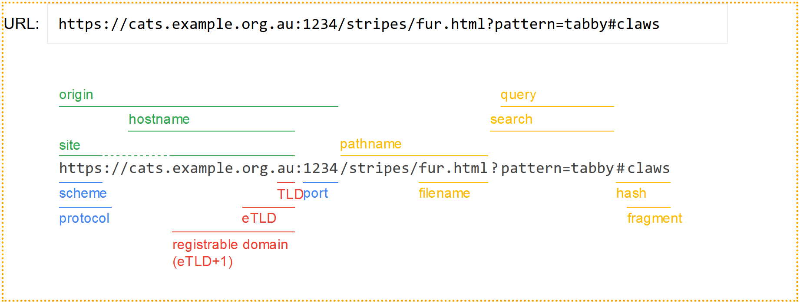
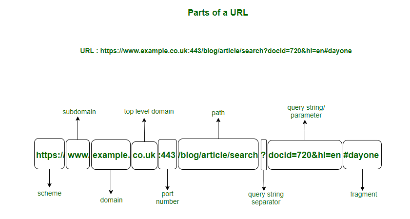

# Domain Name System (DNS)

- [Domain Name System (DNS)](#domain-name-system-dns)
  - [Intro](#intro)
  - [Key Components of DNS](#key-components-of-dns)
    - [FQDN vs Hostname](#fqdn-vs-hostname)
      - [Key Differences](#key-differences)
  - [Summary](#summary)

## Intro

DNS is a fundamental component of the internet that translates human-readable domain names (like www.example.com) into IP addresses (like 192.0.2.1), which computers use to identify each other on the network. DNS functions as the internet's phonebook, enabling users to access websites and services using easily memorable names instead of numeric IP addresses.

## Key Components of DNS

1. Domain Names:
   - Hierarchy: DNS operates on a hierarchical structure, with domains divided into levels separated by dots (e.g., subdomain.example.com).
   - Top-Level Domains (TLDs): These are the highest level in the DNS hierarchy (e.g., .com, .org, .net).
   - Second-Level Domains: These are directly below the TLDs (e.g., example.com).
   - Subdomains: Additional levels under a second-level domain (e.g., www.example.com).
2. DNS Records:
   - A Record: Maps a domain to an IPv4 address.
   - AAAA Record: Maps a domain to an IPv6 address.
   - CNAME Record: Maps a domain to another domain name (used for aliases).
   - MX Record: Directs email to a mail server.
   - TXT Record: Contains text information for verification and other purposes.
   - NS Record: Indicates the authoritative name servers for a domain.
   - PTR Record: Maps an IP address to a domain name (reverse DNS).
3. DNS Resolution Process:
   - Recursive Resolver: A DNS resolver that receives a query from a client (e.g., a web browser) and either returns a cached response or queries other DNS servers to find the answer.
   - Root Name Server: The first step in translating (resolving) human-readable domain names into IP addresses. It directs the query to the appropriate TLD name server.
   - TLD Name Server: Directs the query to the authoritative name server for the specific domain.
   - Authoritative Name Server: Provides the definitive answer for the domain, returning the IP address or other requested record.
4. Caching:
   - DNS resolvers and clients often cache DNS responses to reduce latency and load on DNS servers. Cached records are stored for a time-to-live (**TTL**) period, after which they must be refreshed.
5. DNS Query Types:
   - Recursive Query: The resolver queries other servers on behalf of the client and returns the final answer.
   - Iterative Query: The DNS server provides the best answer it has and may direct the client to another server for more information.
6. Security:
   - DNSSEC (DNS Security Extensions): Adds a layer of security by enabling DNS responses to be verified through cryptographic signatures, protecting against spoofing and other attacks.
   - DNS over HTTPS (DoH) and DNS over TLS (DoT): Encrypt DNS queries to protect user privacy.

### FQDN vs Hostname

1. Hostname: This is the name of a device or a computer on a network. It is a label assigned to a device and is used to identify the device within a local network. For example, if you have a computer named "server1" in your network, "server1" is its hostname.
2. Fully Qualified Domain Name (FQDN): An FQDN is a complete domain name that specifies its exact location in the hierarchy of the Domain Name System (DNS). It includes the hostname and the domain name, providing a full path to the specific host. For example, if your hostname is "server1" and it's in the domain "example.com," the FQDN would be "server1.example.com."

#### Key Differences

- Scope: A hostname is often used within a local network, whereas an FQDN is used to uniquely identify a device across the internet or within a larger domain namespace.
- Structure: An FQDN includes the hostname and the domain name (and possibly subdomains), ending with a top-level domain (TLD) like .com, .org, etc.

## Summary

DNS is a critical service that ensures the accessibility and functionality of the internet by translating domain names into IP addresses, enabling users to easily connect to websites and services. It operates through a distributed and hierarchical system of servers, with caching mechanisms to improve performance and security features like DNSSEC and encrypted DNS to enhance safety.
